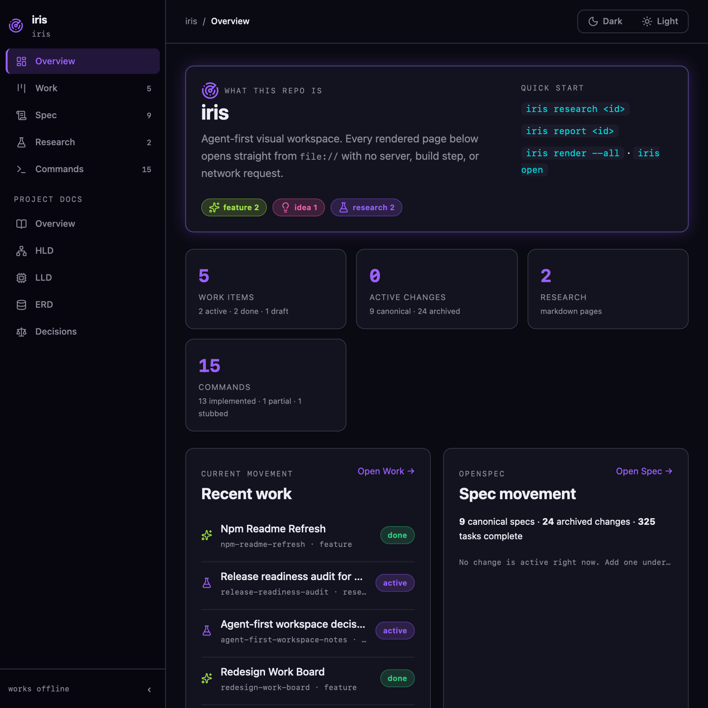

# Iris

[](https://www.npmjs.com/package/@dgtalbug/iris)
[](https://github.com/dgtalbug/iris/actions/workflows/ci.yml)
[](LICENSE)

**A local-first CLI that turns completed AI coding work into visual, versioned documentation.**

Iris gives a repository a navigable offline workspace for features, bugs, plans, research, project architecture, and OpenSpec changes. It runs on your machine, writes plain files you own, and opens from `file://`—no hosted service, account, or always-on server required.



## What you get

```text
agent work or human notes
          │
          ▼
  iris feature | bug | plan | research
          │
          ▼
  typed JSON contracts and Markdown sources
          │
          ▼
     iris render --all
          │
          ▼
  iris/index.html — offline, visual workspace
```

- **Work browser** — List, Table, and Kanban views with filters and a detail drawer.
- **OpenSpec visibility** — active changes, specifications, archives, and real task progress pulled directly from the filesystem.
- **Markdown-first research and architecture** — write normal Markdown; Iris renders project docs and local Mermaid diagrams.
- **Agent-ready setup** — `iris init` installs managed instructions for Codex, Claude Code, and GitHub Copilot while preserving user-owned content.
- **Offline by default** — generated pages need no server, font download, or hosted Iris account.

## Quick start

Requires Node.js **22.13.0 or newer** on macOS, Linux, or Windows.

Run Iris without a global install:

```bash
npx @dgtalbug/iris init
# or: pnpm dlx @dgtalbug/iris init
```

Then record and render a piece of work:

```bash
iris feature add-offline-search
# edit iris/pages/add-offline-search/data.json
iris render --all
iris open
```

Prefer a global command? Install and verify it once:

```bash
pnpm add -g @dgtalbug/iris
iris --version
```

If this is your first global pnpm package, run `pnpm setup` first. For a brand-new release that pnpm has not yet selected because of its `minimumReleaseAge` setting, add `--config.minimumReleaseAge=0`; `npx` does not apply that delay.

## Common commands

| Goal                                                  | Command                                                                                          |
| ----------------------------------------------------- | ------------------------------------------------------------------------------------------------ |
| Create or safely upgrade a workspace                  | `iris init`                                                                                      |
| Create a feature, bug, idea, plan, or report          | `iris feature <id>` · `iris bug <id>` · `iris idea <id>` · `iris plan <id>` · `iris report <id>` |
| Write an investigation in Markdown                    | `iris research <id>`                                                                             |
| Render every source and refresh the OpenSpec snapshot | `iris render --all`                                                                              |
| Add offline Mermaid rendering                         | `iris vendor`                                                                                    |
| Archive or share a page                               | `iris archive <id>` · `iris publish <id>` · `iris export <id> --single`                          |
| Open the workspace                                    | `iris open`                                                                                      |

Every command accepts `--json`. Run `iris --help` for the installed command list and [read the full command reference](docs/cmds.md) for inputs, outputs, preservation rules, and exit codes.

## The workspace

After `iris init`, the generated workspace lives in `iris/`:

| Page                  | Purpose                                                       |
| --------------------- | ------------------------------------------------------------- |
| `iris/index.html`     | Overview, recent work, progress, and project-doc highlights   |
| `iris/work.html`      | Dense List, Table, and Kanban views over records              |
| `iris/spec.html`      | OpenSpec specs, active changes, archives, and task counts     |
| `iris/research.html`  | Markdown research with status, tags, and warnings             |
| `iris/commands.html`  | Generated command reference matching the installed CLI        |
| `iris/project/*.html` | Overview, HLD, LLD, ERD, and decisions rendered from Markdown |

The workspace is deliberately source-owned. Edit `iris/pages/<id>/data.json`, `iris/research/<id>/index.md`, or `iris/project/*.md`; do not hand-edit generated HTML. Run `iris render --all` after a change. Commit those sources and `iris/config.yaml`; rendered HTML, state, bundles, and managed design assets are ignored because Iris recreates them deterministically.

## A complete local workflow

```bash
mkdir my-project && cd my-project
npx @dgtalbug/iris init

# Optional: enable local Mermaid diagrams.
iris vendor

# Capture a finished investigation in Markdown.
iris research cache-stampede-causes
# edit iris/research/cache-stampede-causes/index.md

# Refresh every generated page and inspect it locally.
iris render --all
iris open
```

`iris init` is also the safe upgrade command. It refreshes managed workspace assets and agent surfaces, preserves user content, and never copies or monitors your repository `README.md` or `docs/**/*.md`.

## Security and boundaries

Iris is a plain Node.js CLI. It does not require an AI runtime, server, account, or hosted Iris service. Generated pages are designed for offline `file://` use; content is rendered through a safe Markdown pipeline, and `iris vendor` copies the pinned Mermaid runtime locally.

PNG and PDF export are intentionally unavailable until a deterministic browser-renderer policy is approved. Iris fails explicitly rather than producing mislabeled output. See the [security policy](SECURITY.md) for supported versions and private vulnerability reporting.

## Contributing

Contributions are welcome. Start with [CONTRIBUTING.md](CONTRIBUTING.md); behavioral changes use OpenSpec, and the full local gate is:

```bash
pnpm install
pnpm release:check
```

The install smoke test packs the artifact, installs it into a temporary project, and verifies initialization without runtime network access.

## License

Iris is released under the [MIT License](LICENSE).
