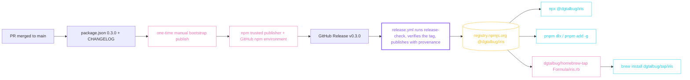

# Release readiness audit handoff

Date: 2026-08-23
Branch baseline: `feat/electric-design-system` at `2654f32`, 15 commits ahead of `main` (`8b7bb92`), no PR, package 0.2.0 unpublished.
Rendered copy: `iris/research/release-readiness-audit/page.html` (source `iris/research/release-readiness-audit/index.md`).

## Question

Is `@dgtalbug/iris` ready for its first public release with three user-facing install paths — `npx`, `pnpm`, and `brew` — and no `npm install -g` in user docs? What is missing, in what order should it be fixed, and which product gaps the owner raised should ride along or follow in their own OpenSpec change?

Audited on 2026-08-23 on branch `feat/electric-design-system` (15 commits ahead of `main`, no PR), `package.json` 0.2.0, Node 26.7.0, pnpm 11.22.0, npm 11.19.0. Read-only: every claim below is backed by a command that was run (see Evidence). No file was edited during the audit.

## Findings

### Headline

- Nothing has ever been released: no git tag, no GitHub Release, `release.yml` has never run, `npm view @dgtalbug/iris` is 404.
- The release pipeline itself is sound (`pnpm release:check` passes end to end; publish job is correctly gated), but its manual prerequisites were never done: the npm package does not exist so a trusted publisher cannot be configured, and the GitHub `npm` environment does not exist.
- `LICENSE` is missing while `package.json` declares MIT.
- `iris --version` and every unknown flag crash with a raw Node stack trace; there is no runtime Node-version guard.
- Skill and command frontmatter never refreshes on re-`init`, so the improved trigger description never reaches early adopters.
- Homebrew: no core formula named `iris`, but a homebrew/cask **cask** `iris` exists, so docs must always say `brew install dgtalbug/tap/iris`. A tap is the only near-term path (repo has 0 stars/forks/watchers).
- pnpm needs nothing extra: publishing to npm *is* the pnpm release. `pnpm dlx` and `pnpm add -g` both work from the packed tarball.

Severity: **BLOCKER** = cannot release · **SHOULD** = fix before v1.0 / brew · **NICE** = later. Effort: S under 1 h · M 1–3 h · L over 3 h.

### A. Release gaps

| # | Sev | Gap | Evidence | Proposed fix | Effort |
|---|---|---|---|---|---|
| A1 | BLOCKER | Nothing released yet: no tag, no GitHub Release, `release.yml` never ran, package absent from npm. | `git tag` empty; `gh release list` empty; `gh run list --workflow release.yml` empty; `npm view @dgtalbug/iris` E404 | Execute the bootstrap sequence in Next steps. | — |
| A2 | BLOCKER (manual) | First publish cannot go through OIDC: npm trusted publishers are configured on the package settings page on npmjs.com, which only exists once the package is on the registry. `npm whoami` locally is E401. `README.md:104` only hints at this. | `npm view` E404; `npm whoami` E401; docs.npmjs.com/trusted-publishers | One manual bootstrap publish (granular token + 2FA), then configure the trusted publisher (owner `dgtalbug`, repo `iris`, workflow `release.yml`, environment `npm`), then revoke the token. Recommended: publish `0.3.0-rc.1 --tag next` so the real `v0.3.0` is the first OIDC/provenance release. | S |
| A3 | BLOCKER | No `LICENSE` file while `package.json:38` says MIT; GitHub reports `license: null`; the packed tarball ships no license text. | `ls LICENSE*` none; `gh api repos/dgtalbug/iris` license null; tarball listing | Add MIT `LICENSE` at root (npm auto-includes `LICENSE*`); required by the brew formula too. | S |
| A4 | BLOCKER (process) | Release must be cut from `main`, but `main` == PR #11 merge (8b7bb92, pre-Electric); this branch is 15 commits ahead with no PR. | `git log origin/main..HEAD` = 15; `gh pr list --head feat/electric-design-system` none | Open the PR, merge after CI; bump the version first (A5). | S |
| A5 | SHOULD | Version: `0.2.0` already labels the pre-Electric main (PR #11 "(v0.2.0)", commit f9ebe9b) but was never tagged or published; this branch changes generated output (Electric tokens, project docs, HLD/LLD, spec tabs). No `CHANGELOG.md`; `release.yml` reads release notes from nowhere. | `package.json:3`; `git show --stat f9ebe9b` | First public version = 0.3.0. Add `CHANGELOG.md` (0.1 to 0.3 summary); `gh release create v0.3.0 --notes-file`. Optionally have `verify-release.mjs` assert a `## [0.3.0]` heading. | S |
| A6 | SHOULD | `iris --version`, `-v`, and any unknown flag die with a raw Node stack trace (`ERR_PARSE_ARGS_UNKNOWN_OPTION`, exit 1). `parseArgs` at `src/cli.ts:18` sits outside the `try` at `src/cli.ts:40`; no `version` option (`src/cli.ts:21-30`). Version is only visible as the first help line (`src/lib/command-catalog.ts:232`). Brew `test do` and the spec's "predictable version" (`openspec/specs/brew-formula-and-installability/spec.md:26-28`) want it. | `node dist/src/index.js --version` exit 1 with stack trace | Add `version: {type:'boolean', short:'v'}` printing `packageVersion()` (already imported at `src/cli.ts:13`; works from the packed layout per `src/lib/package-info.ts:11-25`); move `parseArgs` inside the `try` and map parse errors to `IrisError(1, ...)`; extend the help footer (`command-catalog.ts:237`), not `COMMAND_GROUPS` (a flag is not a command card); document in `docs/cmds.md:5-11`; add `tests/cli-help.test.ts` cases; optionally assert `--version` in `scripts/install-smoke.mjs`. The help-parity check (`install-smoke.mjs:86`) compares installed vs repo help from the same build, so it keeps passing. | S |
| A7 | SHOULD | No runtime Node-version guard; `engines` is only a warning for `npx` (EBADENGINE) and `pnpm dlx` (`engineStrict` default false). Spec requires a simple, actionable message (`brew-formula-and-installability/spec.md:15-17` and `:41-43`); exit-code contract says 2 = environment error (`docs/cmds.md:7`). The only guard lives in `scripts/install-smoke.mjs:12-20`. | `grep versions.node src/` empty; no Node below 22.13 on this machine to test empirically | Pre-import guard in `src/index.ts`: compare `process.versions.node` to the floor, stderr message, `process.exit(2)`; factor `assertSupportedNode(version)` and unit-test it. | S |
| A8 | SHOULD | Skill and command frontmatter never refreshes on re-`init`: the refresh path returns `existing.slice(0,start) + marker + body + existing.slice(end)` (`src/lib/agent-skills.ts:134`); `descriptor.frontMatter` is used only on create (`:200-206`); the digest covers the body only (`:54`). Locked in by `tests/agent-skills.test.ts:75-92`. Dogfood proof: `.claude/skills/iris-workspace/SKILL.md:3` still carries the 73-byte Aug-21-morning description although the file was rewritten Aug 22 19:40 with the new body hash. Skill triggering is description-driven, so the improved trigger text never reaches early adopters. | Reproduced from the packed tarball: description-only change → `15 unchanged`; version bump → `15 updated` but description unchanged | Record a frontmatter digest in the START marker (`fm=sha`); when the prefix before START matches it, replace it with the current frontmatter, else preserve and report. Update the test and `docs/cmds.md:195`. | M |
| A9 | SHOULD | User docs violate the npx/pnpm/brew-only policy and contain pre-release placeholders: `npm install -g` at `README.md:12` and `:92`; "not yet present in the public npm registry" at `README.md:22`; "protected `npm` environment" at `README.md:104` (does not exist yet). `templates/agents/*.md` and `templates/project/*.md` contain no install commands. | grep over README.md, docs/*.md, templates/ | README:12 → `npx @dgtalbug/iris init` / `pnpm dlx @dgtalbug/iris init`; persistent `pnpm add -g @dgtalbug/iris` (note `pnpm setup` / PNPM_HOME) and, once the tap exists, `brew install dgtalbug/tap/iris`; README:92 → `pnpm add -g @dgtalbug/iris@latest` or `npx @dgtalbug/iris@latest init`; keep one honest sentence "published on the npm registry as `@dgtalbug/iris`"; delete README:22 at release; mention that pnpm 11's `minimumReleaseAge` (24 h default) and Homebrew's release cooldown can delay a fresh release. | S |
| A10 | SHOULD | `release.yml` pins `node-version: 22.13.0` (`.github/workflows/release.yml:24`); npm's trusted-publishing docs state npm CLI 11.5.1+ and Node 22.14.0 or higher. Cheap to preempt a red first OIDC run. | docs.npmjs.com/trusted-publishers | Use `node-version: 24` (or `22`) in release.yml only; keep CI at the 22.13.0 floor and add a Node 24 matrix row. Optionally replace `npm install -g npm@11.19.0` + `npm publish` with `pnpm publish --access public --provenance --no-git-checks` (pnpm 11 has native OIDC publish); dry-run first. | S |
| A11 | SHOULD | GitHub environment `npm` does not exist (only `copilot`); GitHub would auto-create it unprotected on first run, so there would be no approval gate despite README/status claiming "protected". | `gh api repos/dgtalbug/iris/environments` → copilot only; `/environments/npm` 404 | Create env `npm` with required reviewer `dgtalbug` and deployment tags `v*`. | S |
| A12 | SHOULD | No branch protection or rulesets on `main`. | `gh api .../branches/main/protection` 404; `.../rulesets` `[]`; `docs/status.md:49` | Ruleset requiring a PR and the CI check `validate`; no force-push. | S |
| A13 | SHOULD | `scripts/verify-release.mjs:7` `requiredFiles` omits `templates/project` although `package.json:28` ships it and `scripts/install-smoke.mjs:50` requires `templates/project/hld.md`. | file read | Add `templates/project` and the five `templates/project/*.md` to the checks; extend `tests/release-packaging.test.ts`. | S |
| A14 | SHOULD | Stale `package-lock.json` tracked alongside `pnpm-lock.yaml` (`packageManager: pnpm@11.22.0`); the lock lacks `lucide` (added on this branch); nothing references it. | `git log -3 -- package-lock.json` last f9ebe9b; `grep -c '"node_modules/lucide"' package-lock.json` = 0 | `git rm package-lock.json`; add to `.gitignore`. | S |
| A15 | SHOULD | `prepack` is `npm run build` in a pnpm project (`package.json:47`); triggers a full tsc on every `npm pack`. | file read | `"prepack": "tsc -p tsconfig.json"` (manager-neutral). | S |
| A16 | SHOULD | OpenSpec change `electric-design-system` is complete (31 checked, 0 unchecked) but unarchived; canonical specs have no "electric" (capability still `aperture-design-system`); `docs/status.md:3` names branch `feat/project-docs-hld-lld` and "one active change"; `docs/status.md:45-46` risks are stale; `docs/tech.md:6-7` pins Ajv 8.17.1 / Vitest 3.2.4 vs package.json 8.18.0 / 3.2.6. Test count "163" is correct today. | tasks.md counts; `grep -ri electric openspec/specs` empty | Archive `electric-design-system` and sync deltas; rewrite status.md header and risks; fix tech.md pins. | S |
| A17 | SHOULD | Homebrew: no core formula `iris`, but a homebrew/cask cask `iris` (blue-light filter 1.2.2) exists, so a bare `brew install iris` resolves to the cask even after tapping. Repo has 0 stars/forks/watchers, below core notability (75/30/30; 225/90/90 for self-submission). The spec forbids a placeholder formula until tarball URL + sha256 exist (`brew-formula-and-installability/spec.md:31-32`). | `brew info iris` → cask; formulae.brew.sh formula/iris.json 404; `gh api repos/dgtalbug/iris` 0/0/0 | After v0.3.0 is on npm: `brew tap-new dgtalbug/tap`; `brew create --node --tap dgtalbug/tap --set-name iris --set-license MIT https://registry.npmjs.org/@dgtalbug/iris/-/iris-0.3.0.tgz`; sha256 via `curl ... \| shasum -a 256`; docs always say `brew install dgtalbug/tap/iris` (or name the formula `iris-cli`). Automate bumps with a `homebrew` job in release.yml (`needs: package`, poll `npm view ... dist.tarball`, then `mislav/bump-homebrew-formula-action`). Formula draft below. | M |
| A18 | NICE | Cold install footprint: 127 packages / 185 MB on disk, mermaid alone 83 MB (about 40 MB download), for a CLI that only copies `mermaid.min.js` in `iris vendor`. npx and pnpm dlx cache it after the first run. | smoke log "added 127 packages"; `du -sh` | Acceptable for v0.3.0. Later: `optionalDependencies`, or `iris vendor` fetching the pinned tarball with checksum verification (conflicts with the offline philosophy — a deliberate decision, not a gate). | M later |
| A19 | NICE | `HELP_TEXT` is computed at import (`src/cli.ts:15`), so a broken package layout throws an uncaught stack trace instead of exit 2. | file read | Compute lazily inside `runCli`. | S |
| A20 | NICE | release.yml: the verify step is skipped on `workflow_dispatch` (`release.yml:29`), so dry runs never exercise `verify-release.mjs`; concurrency group keyed on `github.ref`; actions not SHA-pinned; no `dependabot.yml` (only security updates on); `pnpm format` not in CI or `release:check`. The publish guard itself is correct (`if: github.event_name == 'release'` on verify and publish, `id-token: write` job-scoped, no `NPM_TOKEN`). | file reads; `gh api .../actions/permissions` | Fallback tag for dry runs; constant concurrency group; pin SHAs; add dependabot (npm + github-actions); add `pnpm format`. | S |
| A21 | NICE | Command/prompt frontmatter is minimal: Claude `name`/`description` only (`src/lib/agent-skills.ts:161-167`), no `argument-hint` although every action takes an id; Copilot only `description` (`:169-174`). Will not reach existing installs until A8 is fixed. | file reads | Add `argument-hint` and `mode: agent`. | S |
| A22 | NICE | install-smoke idempotency coverage is thin: asserts only exit 0 for both inits and file existence; no diff of run 1 vs run 2, no "0 created, 0 updated, 15 unchanged" assertion, no conflict path, no frontmatter check, no pnpm leg. Unit tests cover managed-region semantics well (`tests/agent-skills.test.ts:43-212`). | file reads; covered manually in this audit | Capture stdout of run 2 and assert the unchanged line; byte-compare SKILL.md across runs; optional pnpm leg. | S |
| A23 | NICE | Tracked for a public repo: `iris/design/vendor/mermaid.min.js` (3.5 MB dogfood churn), `docs/superpowers/` planning files, `BACKLOG.md`; the project-docs/HLD/LLD work on this branch has no OpenSpec change. Missing CONTRIBUTING, SECURITY, CoC, CODEOWNERS, templates. | `git ls-files` counts | Untrack `mermaid.min.js` (keep a `.gitkeep`); decide on `docs/superpowers`; add SECURITY.md and CONTRIBUTING.md as the minimum. | S–M |
| A24 | NICE | Uncommitted `AGENTS.md` / `CLAUDE.md`: only the GitNexus stats line (2959/4585/206 → 3112/4837/222). GitNexus also warns that FTS indexes are missing. | `git diff` | Commit as `chore: refresh GitNexus index stats`; run `npx gitnexus analyze --force`. | S |
| A25 | NICE | Dependencies: `pnpm audit` reports 0 vulnerabilities. Outdated: ajv 8.18 → 8.20, lucide 0.469 → 1.33 (pinned to Vision per `docs/design-system.md:42`), TypeScript 5.9 → 7.0, vitest 3.2 → 4.1, eslint 9 → 10, prettier, tsx, @types/node, typescript-eslint. | `pnpm audit`, `pnpm outdated` | Not release-blocking; schedule majors post-release. | M later |
| — | Verified OK | Tarball payload clean: 55 files, 74.5 kB packed / 296 kB unpacked — `dist/src`, `schemas`, `templates/agents`, `templates/project`, `README.md`, `package.json`; no tests, `iris/`, or `openspec/`. Shebang present; bin has no exec bit inside the tarball but npm and pnpm set it at link time (smoke and the simulations ran it). `--help` exit 0; no-args exit 0; unknown command → `Unknown command: X`, exit 1. SKILL.md frontmatter conforms to the Agent Skills spec (`name` 14 chars, `description` 222 chars, `license`, `metadata`). The skill body references only commands that exist in `COMMAND_GROUPS`; `docs/cmds.md` command set equals the catalog. `pnpm release:check` passes end to end. | see Evidence | — | — |

### Release path



### Homebrew formula draft (placeholders until the tarball exists)

```ruby
class Iris < Formula
  desc "Visual, versioned HTML docs for AI coding work"
  homepage "https://github.com/dgtalbug/iris"
  url "https://registry.npmjs.org/@dgtalbug/iris/-/iris-VERSION.tgz"
  sha256 "SHA256_OF_THAT_TARBALL"
  license "MIT"
  depends_on "node"
  def install
    system "npm", "install", *std_npm_args
    bin.install_symlink libexec.glob("bin/*")
  end
  test do
    assert_match "iris v#{version}", shell_output("#{bin}/iris --help")
    system bin/"iris", "init"
    assert_path_exists testpath/"iris"
  end
end
```

### B. Product gaps raised by the owner

These are not release blockers for v0.3.0 unless marked; each is sized and pointed at the spec it would change so they can become OpenSpec changes.

| # | Sev | Gap | Evidence | Proposed shape | Effort |
|---|---|---|---|---|---|
| P1 | SHOULD (UX) | Dark/light theme switch needs a better design. Today it is a two-button "Dark / Light" segmented control in the sidebar with `aria-pressed`, persisted under `iris-theme`, plus the `t` shortcut; diagrams re-theme from an `iris:theme` event. | `src/templates/shell.ts:176-178`; `src/templates/script.ts:30-43`; footer hint `shell.ts:148` | One compact toggle in the top bar (sun/moon glyph, `aria-pressed`, visible focus ring), optional third "System" state following `prefers-color-scheme`, reduced-motion-safe transition, keyboard hint kept. Spec: MODIFIED scenario in the design-system capability (theme toggle) plus `markdown-diagram-rendering` "theme is changed while diagrams are rendered" stays green. | S–M |
| P2 | SHOULD (decision) | "Exact source" disclosures can be removed. Spec detail pages render `<details class="spec-source-details"><summary>Exact source</summary>...` three times; README and cmds promise "an exact escaped-source disclosure remains available". Three canonical specs require it, so removal is a spec change, not just a template edit. Open question: keep the separate Mermaid source fallback shown before `iris vendor`, without JavaScript, in print, and in standalone artifacts (a different feature, needed for `file://`). | `src/templates/pages/spec-detail.ts:67,132,163`; `README.md:66`; `docs/cmds.md:26`; `openspec/specs/{openspec-spec-browser,markdown-diagram-rendering,research-markdown-pages}/spec.md`; tests `tests/openspec-browser.test.ts`, `tests/workspace-shell.test.ts` | OpenSpec change with REMOVED/MODIFIED requirement deltas in the three specs, template removal, test updates, README/cmds/status wording. Recommend keeping the Mermaid pre-vendor fallback. | S–M |
| P3 | SHOULD | No clean way for Iris to remove itself from a workspace: the catalog has no `uninstall`/`clean`/`remove`, and `iris init` leaves files in `iris/`, `.agents/skills`, `.claude/skills`, `.claude/commands/iris`, `.github/skills`, `.github/prompts`, and a managed `.vscode/tasks.json` entry. | `src/lib/command-catalog.ts` (no such command); managed task at `src/commands/lifecycle.ts:92`; surface targets in `src/lib/agent-skills.ts` | New command `iris uninstall [--purge] [--json]`: remove only Iris-owned generated assets — agent surfaces whose markers and digest prove ownership (reuse the managed-region logic; preserve and report edited or unmarked files), generated `/iris:*` commands and prompts, the managed tasks.json entry, `iris/design/`, generated HTML and `spec.json`; `--purge` additionally deletes `iris/pages`, `iris/research`, `iris/archive`, `iris/project`, `config.yaml`, `state.json` and requires the flag explicitly. Spec: new capability (`workspace-uninstall`) or a requirement added to `project-lifecycle-automation`; docs/cmds.md, help, Commands page, skill body. | M |
| P4 | SHOULD | First run via an agent should populate all five project docs, not only HLD/LLD. The skill row "initialized Iris" lands in `hld.md + lld.md` only; the guidance paragraph asks for HLD/LLD placeholder replacement; `iris init` prints "next: write iris/project/hld.md and iris/project/lld.md"; there is no `/iris:init` or `/iris:project` command telling the agent to fill overview, HLD, LLD, ERD and decisions from the codebase. | `templates/agents/iris-workspace.md:11,25`; `src/commands/init.ts:86`; `templates/agents/iris-commands.md` (no init/project action) | Extend the skill table and paragraph to all five docs; make `init` print all five paths (and list them in `--json`); add a generated `/iris:project` (or `/iris:init`) command: run `iris init`, fill each project doc from the codebase, `iris render --all`, report paths. Spec: MODIFIED requirement in `agent-first-initialization` (skill names every project doc) and a backfilled project-docs requirement (A23 notes none exists). Note: the skill body change propagates (managed), but the new command's description will be stuck for existing installs until A8. | S–M |
| P5 | SHOULD (direction) | The dashboard reads as a "weird mix" / Notion-like; the owner wants bright enterprise colours. Vision "Electric" v2.0 was adopted on this very branch days ago and is unmerged (A16); the token block in `tokens.ts` is the single source, and token-lint enforces contrast and control-boundary floors, so a re-theme is a token swap plus review. | `src/templates/tokens.ts`; `docs/design-system.md:1-3`; `docs/tech.md:91` ("reduces a future restyle to a token-block swap"); `scripts/token-lint.mjs`, `scripts/token-contract.mjs`, `tests/token-contract.test.mjs` | Do not re-theme inside the release PR. Open one OpenSpec change (`brand-and-palette`) for 0.4.0 bundling P1, P5, P6: define "bright enterprise" concretely (two or three reference products or screenshots, primary/accent chroma targets, light surfaces near-white, dark surfaces navy or slate), swap the token block, keep token-lint green, refresh `docs/design-system.md`. If the look is a release blocker for you, say so and the order flips. | M–L |
| P6 | SHOULD (direction) | Branding: no logo or wordmark — the sidebar brand is the Lucide `radar` icon; fonts are system stacks; icons are Lucide 0.469 inlined as SVG. Generated pages must stay font-, script- and network-free, so a brand typeface has to be embedded (subset woff2 as a data URI, OFL-licensed, roughly 20–40 KB per weight) or stay system. | `src/templates/icons.ts:14` (`brand: 'radar'`); `src/templates/shell.ts:90-91`; `src/templates/tokens.ts:40-41`; README "no font, script, or network request" | Inline SVG mark + wordmark in the shell and a data-URI favicon; one embedded display face for headings only (body stays system); keep Lucide for UI icons (a custom icon set is a separate, larger lift). Same `brand-and-palette` change as P5. | M |

## Evidence

Commands run on 2026-08-23 (exit codes and trimmed output):

| Command | Exit | Output (trimmed) |
|---|---|---|
| `node --version; pnpm --version; npm --version` | 0 | v26.7.0 / 11.22.0 / 11.19.0 |
| `pnpm install --frozen-lockfile` | 0 | Already up to date |
| `pnpm release:check` | 0 | Test Files 26 passed, Tests 163 passed; html-check OK 13 files, 268 refs; smoke: added 127 packages, init#1 15 created, init#2 15 unchanged, vendored Mermaid 11.17.0, install smoke passed for @dgtalbug/iris@0.2.0 on Node.js 26.7.0 |
| `npm pack --dry-run` | 0 | 55 files, 74.5 kB packed, 296.4 kB unpacked: README.md, package.json, dist/src (cli, index, commands/9, lib/13, templates/8, templates/pages/8), schemas/6, templates/agents/2, templates/project/5. No LICENSE, tests, iris/, openspec/. |
| `tar tvzf dgtalbug-iris-0.2.0.tgz`; `head -1 dist/src/index.js` | 0 | all entries `-rw-r--r--`; `#!/usr/bin/env node` |
| `npm install <tarball>` in a scratch dir | 0 | 127 packages, 185 MB, mermaid 83 MB; `.bin/iris` symlink, target `-rwxr-xr-x` |
| `npx iris --help`; `npx --yes --package=<tarball> iris --help` | 0 / 0 | `iris v0.2.0 / Usage: iris <command> [options]` |
| `npx iris --version`; `-v`; `version`; `bogus`; no args | 1 / 1 / 1 / 1 / 0 | stack trace ERR_PARSE_ARGS_UNKNOWN_OPTION; same; Unknown command: version; Unknown command: bogus; help |
| `node dist/src/index.js` with `--help`, `-h`, `help`, `--version`, `-v`, `-V`, `version`, `bogus`, `--bogus`, none | 0,0,1,1,1,1,1,1,1,0 | as above; `--bogus` also stack-traces |
| `pnpm add <tarball>`; `pnpm exec iris --help`; `--version` | 0 / 0 / 1 | 129 pkgs, 185 MB; help; stack trace |
| `pnpm dlx <tarball> --help`; `pnpm dlx --package=<tarball> iris --help` | 0 / 0 | `iris v0.2.0 ...` |
| Frontmatter repro from the packed tarball: init#1, init#2, mutate description, init#3, bump version, init#4, change body, init#5, edit managed body, init#6 | 0,0,0,0,0,1 | 15 created; 15 unchanged (SKILL.md byte-identical); 15 unchanged, CHANGED-DESC absent in all 5 surfaces; 15 updated, marker version=0.2.1, description still old; 3 updated, body changed, description still old; "Iris agent surface setup is incomplete; .claude/skills/iris-workspace/SKILL.md: managed markers or digest are invalid; preserved the file" |
| `pnpm audit`; `pnpm audit --prod` | 0 | No known vulnerabilities found |
| `pnpm outdated` | — | ajv 8.20.0, lucide 1.33.0, typescript 7.0.2, vitest 4.1.11, eslint 10.9.0, prettier 3.9.6, tsx 4.23.12, @types/node 26.2.0, typescript-eslint 8.67.0 |
| `npm view @dgtalbug/iris version`; `npm whoami` | E404 / E401 | not published; not logged in |
| `git tag`; `gh release list`; `gh run list --workflow release.yml` | 0 | all empty |
| `gh run list --workflow ci.yml` | 0 | latest push on feat/electric-design-system success (2026-08-23) |
| `gh api repos/dgtalbug/iris` | 0 | public, default main, stars/forks/watchers 0/0/0, license null, topics [] |
| `gh api .../environments`; `.../environments/npm`; `.../branches/main/protection`; `.../rulesets` | 0 / 404 / 404 / 0 | only copilot; not found; Branch not protected; [] |
| `gh pr list --state all` | 0 | #11 MERGED "(v0.2.0)"; none for this branch; `git log origin/main..HEAD` = 15 commits |
| `brew info iris`; `curl formulae.brew.sh/api/formula/iris.json` | 0 / 404 | cask iris 1.2.2 (blue-light filter); no core formula |
| `git ls-files` / `ls` governance | 0 | tracked: package-lock.json, pnpm-lock.yaml, iris/ (31 files, 5.4 MB incl. 3.5 MB mermaid.min.js), docs/superpowers/ (2); none of LICENSE, CHANGELOG, CONTRIBUTING, SECURITY, CoC, CODEOWNERS, dependabot.yml |
| `git diff AGENTS.md CLAUDE.md` | 0 | one stats line each |
| grep for `npm install`, `npx `, `pnpm add`, `pnpm dlx`, `brew ` in README.md, docs/*.md, templates/ | 0 | README:12, :19, :22, :92, :109; docs/status.md:48; docs/tech.md:53, :85; templates: none |
| Node below 22.13 runtime check | n/a | not possible locally (only node@24/25/26 installed); A7 is static analysis |

Source lines cited in the tables were read directly: `src/cli.ts`, `src/index.ts`, `src/lib/command-catalog.ts`, `src/lib/package-info.ts`, `src/lib/agent-skills.ts`, `src/lib/errors.ts`, `src/commands/init.ts`, `src/commands/lifecycle.ts`, `src/templates/{shell,script,icons,tokens}.ts`, `src/templates/pages/spec-detail.ts`, `scripts/{verify-release,install-smoke,token-lint,token-contract}.mjs`, `.github/workflows/{ci,release}.yml`, `tests/{cli-help,agent-skills,release-packaging,openspec-browser,workspace-shell}.test.ts`, `templates/agents/*.md`, `openspec/specs/*/spec.md`, `docs/*.md`, `README.md`, `package.json`, `tsconfig.json`.

## Next steps

### Ordered checklist for v0.3.0

"You" = manual action outside the repo. "Agent" = repo change (impact analysis before each symbol edit).

1. Agent — Add `LICENSE` (MIT), `CHANGELOG.md` with `## [0.3.0]`, `SECURITY.md`, minimal `CONTRIBUTING.md`. (A3, A5, A23)
2. Agent — CLI: `--version` / `-v`; `parseArgs` inside `try` with a clean exit-1 message; Node floor guard with exit 2; lazy `HELP_TEXT`; tests and docs/cmds.md. (A6, A7, A19)
3. Agent — Frontmatter refresh via a frontmatter digest in the marker, tests, docs/cmds.md. (A8)
4. Agent — Packaging hygiene: `prepack` → `tsc -p tsconfig.json`; remove `package-lock.json` and ignore it; `verify-release.mjs` and the packaging test cover `templates/project`. (A13–A15)
5. Agent — release.yml: Node 24 for the publish job, unconditional verify with fallback tag, constant concurrency group; CI: Node 24 row and `pnpm format`; add `dependabot.yml`. (A10, A20)
6. Agent — Docs: README install/upgrade rewritten to `npx` / `pnpm dlx` / `pnpm add -g` (with `pnpm setup` and 24 h `minimumReleaseAge` notes), remove "not yet present", say "hosted on the npm registry"; brew line only after step 12; fix docs/status.md and docs/tech.md; archive `electric-design-system` and sync specs; commit the GitNexus stat-line change. (A9, A16, A24)
7. Agent — Bump `package.json` to 0.3.0 (`chore: release 0.3.0`), run `pnpm release:check` and GitNexus change detection, open the PR. (A4, A5)
8. You — Create GitHub environment `npm` (required reviewer, tags `v*`); add a `main` ruleset (PR + `validate` check). (A11, A12)
9. You — Merge the PR to `main` after CI is green.
10. You (one-time bootstrap) — `npm login` (granular token + 2FA); from a clean checkout of `main`, set version `0.3.0-rc.1` locally (uncommitted), `pnpm install && pnpm build && npm publish --access public --tag next`; verify `npm view @dgtalbug/iris versions`; on npmjs.com package Settings → Trusted Publisher: GitHub Actions, owner `dgtalbug`, repo `iris`, workflow `release.yml`, environment `npm`; enable "require 2FA / disallow tokens"; revoke the token. Alternative: bootstrap `0.3.0` directly and make `0.3.1` the first automated release. (A2)
11. You — `gh release create v0.3.0 --target main --title v0.3.0 --notes-file` (CHANGELOG excerpt); approve the `npm` environment; confirm `release.yml` green; verify `npm view @dgtalbug/iris version` = 0.3.0 and `dist.attestations` present; `npx @dgtalbug/iris --version`; `pnpm dlx @dgtalbug/iris --help` (may need `--config.minimumReleaseAge=0` on day one).
12. You — `brew tap-new dgtalbug/tap`; `brew create --node --tap dgtalbug/tap --set-name iris --set-license MIT https://registry.npmjs.org/@dgtalbug/iris/-/iris-0.3.0.tgz`; replace the `test do`; `brew install --build-from-source dgtalbug/tap/iris && brew test dgtalbug/tap/iris && brew audit --strict --new dgtalbug/tap/iris`; push. (A17)
13. Agent — Add `brew install dgtalbug/tap/iris` to README; add the `homebrew` bump job to release.yml (you create the `COMMITTER_TOKEN` secret with repo + workflow scope); mark the brew channel available in the spec and status docs. Ship as 0.3.1 or fold into the next release.

### Proposed OpenSpec grouping

1. `release-readiness-0-3-0` — steps 1–7 above (A3, A5–A10, A13–A16, A19, A20, A23, A24) as one change against `brew-formula-and-installability` (install/version/Node-guard scenarios) and `agent-first-initialization` (frontmatter refresh).
2. `workspace-uninstall` — P3, new capability or `project-lifecycle-automation` requirement; small enough for 0.3.x.
3. `agent-first-project-docs` — P4 plus a backfilled project-docs requirement; could be merged into change 1 since it edits the same skill template.
4. `remove-source-disclosure` — P2; decide first whether the Mermaid pre-vendor fallback stays.
5. `brand-and-palette` — P1, P5, P6 together for 0.4.0; needs two or three reference points for "bright enterprise" before tokens are touched.

### Direct answers

1. Is `iris-workspace` a proper skill, and releasable on its own? Yes, it conforms to the Agent Skills spec and Claude Code loads it; no, it is not releasable on its own today — no plugin manifest, no tracked `skills/` directory, and its body depends on the `iris` binary. Keep CLI-installed for 0.3.0; fix A8 first.
2. Can we release via pnpm? Yes, automatically once the package is on npm; document `pnpm setup` and the 24 h `minimumReleaseAge` gotcha.
3. Can we release via brew? Yes, via `dgtalbug/homebrew-tap` after the npm tarball exists; always `brew install dgtalbug/tap/iris` because a cask named `iris` already exists; automate formula bumps from release.yml.
4. Can user-facing install be npx/pnpm/brew only, with no `npm install`? Yes — a docs change only; the package is still hosted on the npm registry and internal tooling may keep using npm.
