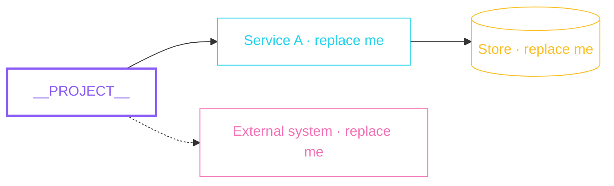
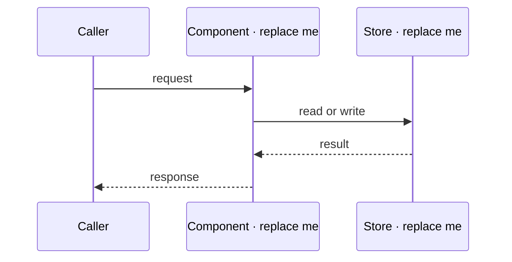
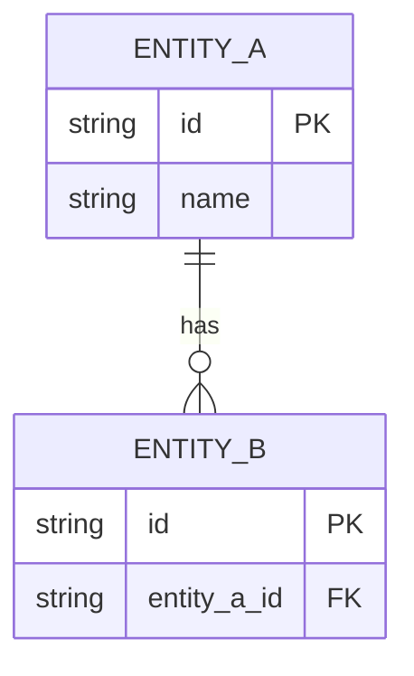

# Project docs as Markdown, HLD/LLD Mermaid, spec tabs — Implementation Plan

> **For agentic workers:** REQUIRED SUB-SKILL: Use superpowers:subagent-driven-development (recommended) or superpowers:executing-plans to implement this plan task-by-task. Steps use checkbox (`- [ ]`) syntax for tracking.

**Goal:** Make the five project docs editable Markdown sources with Mermaid skeletons that `iris init` scaffolds and Iris renders, give feature contracts HLD/LLD Mermaid sections, split each OpenSpec change into Proposal / Design / Tasks / Specs tabs, project the HLD onto the Overview, and teach the agent surfaces to fill HLD/LLD at init and after features.

**Architecture:** A new bounded loader (`src/lib/project-docs.ts`) reads `iris/project/<name>.md` through the existing front-matter parser, a new page module (`src/templates/pages/project-doc.ts`) renders it through the same safe Markdown + Mermaid pipeline research pages use, and `renderSectionPages` writes `iris/project/<name>.html` as managed output. Scaffolding lives in `lifecycle.ts` next to the current placeholder logic and reads packaged Markdown templates under `templates/project/` (they hold Mermaid `classDef` hex colours, which `token-lint` forbids anywhere under `src/`). A shared `tabGroup` helper in `src/templates/common.ts` renders the tablists used by the Spec change detail and by feature pages; `script.ts` gains `wireTabs(root)` so tabs injected from the spec bundle work, and `setupMermaid` re-queries figures so diagrams inside injected content render.

**Tech Stack:** Node ≥ 22.13, TypeScript (strict, ESM, `.js` import specifiers), vitest, eslint, prettier, markdown-it (existing `renderDocument` / `renderSafeMarkdown`), Mermaid 11 vendored runtime, Ajv 2020 schemas.

**Spec:** `docs/superpowers/specs/2026-08-22-project-docs-hld-lld-design.md`

## Global Constraints

- Node.js `>=22.13.0`; run everything with `pnpm` (11.22). Tests: `pnpm test` (vitest, imports `runCli` from `src/cli.js` — no build needed). Full gate: `pnpm release:check` = lint + token-lint + typecheck + test + html-check + smoke:install.
- `scripts/token-lint.mjs` rejects any hex / rgb / oklch literal in `src/**/*.{ts,js,css,html}` except the `TOKENS_CSS` block. Mermaid `classDef` hex colours therefore live only in packaged Markdown templates under `templates/project/`, never in `src/`.
- `tests/agent-skills.test.ts` requires `templates/agents/iris-workspace.md` to stay **under 4096 bytes** and to contain every content command's `usage` and `lands` string from `src/lib/command-catalog.ts`.
- `pnpm format` is `prettier --check .`; run `pnpm exec prettier --write <files you touched>` before each commit (Markdown tables get re-aligned by prettier, so never assert exact table spacing in tests).
- Rendered HTML must stay `file://`-safe: classic scripts only, relative links only (`scripts/html-check.mjs` verifies every local `href`/`src` resolves).
- Project doc HTML outputs carry `data-iris-managed` on `<html>`; `isManaged()` in `lifecycle.ts` keys off that attribute (or the legacy pending stub).
- Comments: only non-obvious _why_; no spec/requirement tracking tags. Commit messages: conventional (`feat:`, `test:`, `docs:`, `chore:`), **no `Co-Authored-By` trailer**.
- Project rule (CLAUDE.md): before editing an exported symbol run `mcp__gitnexus__impact({target, direction: "upstream"})` and state the blast radius in your task report; before each commit run `mcp__gitnexus__detect_changes()`. Render-path symbols (`renderShell`, `renderSectionPages`, `renderContractPage`, `changeDetailContent`, `overviewPageContent`) will read HIGH — the design spec pre-approved this scope, so report it and proceed.
- Never invent repository content inside scaffolds: placeholder nodes are labelled `replace me`; only the project directory name is substituted.

---

## Prerequisite (human decision, do first)

`feat/electric-design-system` carries the **uncommitted** Electric redesign (≈46 modified files, including `contract-page.ts`, `overview.ts`, `script.ts`, `workspace.ts`, which this plan also edits). Committing only this plan's hunks from those files is not possible with non-interactive git. Before Task 1:

- [ ] Ask the user to commit the Electric work on `feat/electric-design-system` (e.g. `git add -A && git commit -m "feat: adopt the Electric design system"`), or to tell you how they want it handled. Do not commit their work unasked.
- [ ] Then `git checkout -b feat/project-docs-hld-lld` from that commit. All task commits below land on this branch.
- [ ] `pnpm install && pnpm test` — confirm green before touching anything (record the count of passing tests).

---

### Task 1: Packaged project-doc templates and the skeleton reader

**Files:**

- Create: `templates/project/overview.md`, `templates/project/hld.md`, `templates/project/lld.md`, `templates/project/erd.md`, `templates/project/decisions.md`
- Create: `src/lib/project-docs.ts` (skeleton reader part; the loader is Task 2)
- Modify: `package.json` (`files` array), `scripts/install-smoke.mjs:47-51` (required packed paths)
- Test: `tests/project-docs.test.ts` (new)

**Interfaces:**

- Consumes: `packageRoot()` from `src/lib/package-info.ts`; `PROJECT_DOC_NAMES` from `src/templates/common.ts`.
- Produces: `type ProjectDocName = 'overview' | 'hld' | 'lld' | 'erd' | 'decisions'`; `projectDocsRoot(cwd): string`; `projectDocSourcePath(cwd, name): string` (→ `iris/project/<name>.md`); `projectDocOutputPath(cwd, name): string` (→ `iris/project/<name>.html`); `projectDocSkeleton(name, projectName): Promise<string>`.

- [ ] **Step 1: Write the five templates**

`templates/project/overview.md`:

```markdown
---
title: Overview
status: draft
---

# Overview

What **PROJECT** is, who it is for, and what it deliberately is not. Replace every placeholder below; Iris never invents content.

## What this is

One paragraph: the problem this repository solves and for whom.

## How it runs

How a change travels from source to the running system: build, test, deploy, or the equivalent.

## Where things live

| Path   | Holds                                                               |
| ------ | ------------------------------------------------------------------- |
| `src/` | Replace with the real top-level directories and what each one owns. |
```

`templates/project/hld.md`:

````markdown
---
title: HLD
status: draft
---

# HLD

High-level design: the shape of **PROJECT** and how its parts fit together. Replace the placeholder nodes below with the real components and keep the `classDef` lines so colours keep their meaning: violet is the thing being described, cyan a service, amber a data store, lime an async path, pink an external system, red an error path.

## System map



## Boundaries

Which subsystems exist, what crosses each boundary, and what deliberately does not.

## External dependencies

| Dependency | Why it is here |
| ---------- | -------------- |
| Replace me | Replace me     |
````

`templates/project/lld.md`:

````markdown
---
title: LLD
status: draft
---

# LLD

Low-level design: how a component of **PROJECT** actually works inside its boundary. Replace the placeholder participants and steps with the real call path.

## Key flow



## Modules

| Module     | Responsibility | Invariant  |
| ---------- | -------------- | ---------- |
| Replace me | Replace me     | Replace me |

## Data shapes

The records, messages, or files that cross module boundaries, and what each field means when the name alone does not say.
````

`templates/project/erd.md`:

````markdown
---
title: ERD
status: draft
---

# ERD

The data model of **PROJECT**: entities, their fields, and the relationships between them. Replace the placeholder entities with the real ones.

## Entities



## Notes

Field meanings the name alone does not carry, constraints and keys, and the lifecycle of each record.
````

`templates/project/decisions.md`:

```markdown
---
title: Decisions
status: draft
---

# Decisions

The decision log of **PROJECT**: what was chosen, when, and why the alternatives lost. Append one row per decision; keep reversed decisions and mark them superseded instead of deleting them.

## Decisions

| Date       | Decision   | Why        | Status   |
| ---------- | ---------- | ---------- | -------- |
| YYYY-MM-DD | Replace me | Replace me | accepted |
```

Then run `pnpm exec prettier --write templates/project` (tables get aligned; that is fine).

- [ ] **Step 2: Write the failing test**

`tests/project-docs.test.ts`:

````ts
import { describe, expect, it } from 'vitest';
import { projectDocSkeleton } from '../src/lib/project-docs.js';
import { PROJECT_DOC_NAMES } from '../src/templates/common.js';

describe('project doc skeletons', () => {
  it('ships a front-mattered skeleton for every project doc', async () => {
    for (const name of PROJECT_DOC_NAMES) {
      const skeleton = await projectDocSkeleton(name, 'demo-app');
      expect(skeleton.startsWith('---\n'), name).toBe(true);
      expect(skeleton, name).toContain('status: draft');
      expect(skeleton, name).toContain('demo-app');
      expect(skeleton, name).not.toContain('__PROJECT__');
    }
  });

  it('carries the expected Mermaid diagram type per design doc', async () => {
    const hld = await projectDocSkeleton('hld', 'demo-app');
    expect(hld).toMatch(/```mermaid\nflowchart LR/);
    expect(hld).toContain('classDef focus');
    expect(hld).toContain('## System map');
    expect(await projectDocSkeleton('lld', 'demo-app')).toMatch(/```mermaid\nsequenceDiagram/);
    expect(await projectDocSkeleton('erd', 'demo-app')).toMatch(/```mermaid\nerDiagram/);
    expect(await projectDocSkeleton('overview', 'demo-app')).not.toContain('```mermaid');
    expect(await projectDocSkeleton('decisions', 'demo-app')).toMatch(
      /\| Date\s+\| Decision\s+\| Why\s+\| Status\s+\|/,
    );
  });

  it('keeps a quote in the project name from breaking a Mermaid label', async () => {
    const skeleton = await projectDocSkeleton('hld', 'my "quoted" app');
    expect(skeleton).toContain(`app["my 'quoted' app"]`);
  });
});
````

- [ ] **Step 3: Run the test to verify it fails**

Run: `pnpm vitest run tests/project-docs.test.ts`
Expected: FAIL — `Cannot find module '../src/lib/project-docs.js'`.

- [ ] **Step 4: Write the skeleton reader**

`src/lib/project-docs.ts`:

```ts
import { readFile } from 'node:fs/promises';
import path from 'node:path';
import { packageRoot } from './package-info.js';
import { PROJECT_DOC_NAMES } from '../templates/common.js';

export type ProjectDocName = (typeof PROJECT_DOC_NAMES)[number];

const PROJECT_PLACEHOLDER = /__PROJECT__/g;

export function projectDocsRoot(cwd: string): string {
  return path.join(cwd, 'iris', 'project');
}

export function projectDocSourcePath(cwd: string, name: ProjectDocName): string {
  return path.join(projectDocsRoot(cwd), `${name}.md`);
}

export function projectDocOutputPath(cwd: string, name: ProjectDocName): string {
  return path.join(projectDocsRoot(cwd), `${name}.html`);
}

/** The packaged Markdown skeleton for one project doc with the project name filled in. */
export async function projectDocSkeleton(
  name: ProjectDocName,
  projectName: string,
): Promise<string> {
  const template = await readFile(
    path.join(packageRoot(), 'templates', 'project', `${name}.md`),
    'utf8',
  );
  // The name lands inside double-quoted Mermaid labels; a quote would end the label early.
  return template.replace(PROJECT_PLACEHOLDER, projectName.replace(/"/g, "'"));
}
```

- [ ] **Step 5: Ship the templates in the package**

In `package.json`, change `"files"` to:

```json
"files": [
  "dist/src",
  "schemas",
  "templates/agents",
  "templates/project",
  "README.md"
],
```

In `scripts/install-smoke.mjs`, extend the required list:

```js
for (const requiredPath of [
  'dist/src/lib/agent-skills.js',
  'templates/agents/iris-workspace.md',
  'templates/agents/iris-commands.md',
  'templates/project/hld.md',
]) {
```

- [ ] **Step 6: Run the test to verify it passes**

Run: `pnpm vitest run tests/project-docs.test.ts`
Expected: PASS (3 tests).

- [ ] **Step 7: Lint, format, commit**

```bash
pnpm exec prettier --write templates/project src/lib/project-docs.ts tests/project-docs.test.ts package.json scripts/install-smoke.mjs
pnpm lint && pnpm typecheck
git add templates/project src/lib/project-docs.ts tests/project-docs.test.ts package.json scripts/install-smoke.mjs
git commit -m "feat: package Markdown skeletons for the five project docs"
```

(Run `mcp__gitnexus__detect_changes()` first; expected: only new symbols in `src/lib/project-docs.ts`.)

---

### Task 2: Bounded loader for project doc sources

**Files:**

- Modify: `src/lib/project-docs.ts`
- Test: `tests/project-docs.test.ts`

**Interfaces:**

- Consumes: `parseFrontMatter` from `src/lib/front-matter.ts` (`{ data: { title|null, status|null, tags, agent|null, updated|null }, body, warnings: string[] }`); `projectDocMeta(name).label` from `src/templates/common.ts`.
- Produces:

  ```ts
  export type ProjectDocWarning = { code: string; path: string; message: string };
  export type ProjectDocItem = {
    name: ProjectDocName;
    path: string;
    title: string;
    status: string;
    agent: string;
    updated: string;
    body: string;
    warnings: ProjectDocWarning[];
  };
  export type ProjectDocsSnapshot = { items: ProjectDocItem[]; warnings: ProjectDocWarning[] };
  export function firstMermaidFence(body: string): string | null;
  export async function loadProjectDocs(cwd: string): Promise<ProjectDocsSnapshot>;
  ```

- [ ] **Step 1: Write the failing tests**

Append to `tests/project-docs.test.ts` (add the imports at the top of the file):

````ts
import { mkdir, mkdtemp, rm, symlink, writeFile } from 'node:fs/promises';
import os from 'node:os';
import path from 'node:path';
import { afterEach } from 'vitest';
import { firstMermaidFence, loadProjectDocs } from '../src/lib/project-docs.js';

const tempDirs: string[] = [];

afterEach(async () => {
  await Promise.all(tempDirs.splice(0).map((dir) => rm(dir, { recursive: true, force: true })));
});

async function createTempDir(): Promise<string> {
  const dir = await mkdtemp(path.join(os.tmpdir(), 'iris-project-docs-'));
  tempDirs.push(dir);
  return dir;
}

async function writeDoc(cwd: string, name: string, content: string): Promise<string> {
  const target = path.join(cwd, 'iris', 'project', `${name}.md`);
  await mkdir(path.dirname(target), { recursive: true });
  await writeFile(target, content, 'utf8');
  return target;
}

describe('project doc loader', () => {
  it('loads only the five fixed sources, in catalog order, with front matter fallbacks', async () => {
    const cwd = await createTempDir();
    await writeDoc(cwd, 'lld', '# Inner workings\n\ntext\n');
    await writeDoc(
      cwd,
      'hld',
      '---\ntitle: System shape\nstatus: active\nupdated: 2026-08-22\n---\n\n## Map\n\n```mermaid\nflowchart LR\n  A --> B\n```\n',
    );
    await writeDoc(cwd, 'notes', '# ignored\n');

    const snapshot = await loadProjectDocs(cwd);

    expect(snapshot.items.map((item) => item.name)).toEqual(['hld', 'lld']);
    const [hld, lld] = snapshot.items;
    expect(hld.title).toBe('System shape');
    expect(hld.status).toBe('active');
    expect(hld.updated).toBe('2026-08-22');
    expect(hld.agent).toBe('not set');
    expect(hld.path).toBe('iris/project/hld.md');
    expect(lld.title).toBe('Inner workings');
    expect(lld.status).toBe('draft');
    expect(firstMermaidFence(hld.body)).toBe('flowchart LR\n  A --> B');
    expect(firstMermaidFence(lld.body)).toBeNull();
    expect(snapshot.warnings).toEqual([]);
  });

  it('falls back to the doc label when neither front matter nor a heading names it', async () => {
    const cwd = await createTempDir();
    await writeDoc(cwd, 'erd', 'just text\n');
    const { items } = await loadProjectDocs(cwd);
    expect(items[0].title).toBe('ERD');
  });

  it('returns nothing for a project without iris/project', async () => {
    const cwd = await createTempDir();
    expect(await loadProjectDocs(cwd)).toEqual({ items: [], warnings: [] });
  });

  it('warns about symlinked, oversized, and malformed sources without throwing', async () => {
    const cwd = await createTempDir();
    const hld = await writeDoc(cwd, 'hld', '# HLD\n');
    await symlink(hld, path.join(cwd, 'iris', 'project', 'lld.md'));
    await writeDoc(cwd, 'erd', `# ERD\n${'x'.repeat(256 * 1024 + 1)}\n`);
    await writeDoc(cwd, 'decisions', '---\nupdated: not-a-date\n---\n\n# Decisions\n');

    const snapshot = await loadProjectDocs(cwd);

    expect(snapshot.items.map((item) => item.name)).toEqual(['hld', 'decisions']);
    expect(snapshot.warnings.map((warning) => [warning.code, warning.path])).toEqual([
      ['symlink', 'iris/project/lld.md'],
      ['too-large', 'iris/project/erd.md'],
      ['front-matter', 'iris/project/decisions.md'],
    ]);
    expect(snapshot.warnings[2].message).toContain('not an ISO date');
    expect(snapshot.items[1].warnings).toHaveLength(1);
  });
});
````

- [ ] **Step 2: Run the tests to verify they fail**

Run: `pnpm vitest run tests/project-docs.test.ts`
Expected: FAIL — `loadProjectDocs` / `firstMermaidFence` are not exported.

- [ ] **Step 3: Implement the loader**

Append to `src/lib/project-docs.ts` (and change the first import to `import { lstat, readFile } from 'node:fs/promises';`, add `import { parseFrontMatter } from './front-matter.js';`, and import `projectDocMeta` alongside `PROJECT_DOC_NAMES`):

````ts
const MAX_SOURCE_BYTES = 256 * 1024;

export type ProjectDocWarning = { code: string; path: string; message: string };

export type ProjectDocItem = {
  name: ProjectDocName;
  path: string;
  title: string;
  status: string;
  agent: string;
  updated: string;
  body: string;
  warnings: ProjectDocWarning[];
};

export type ProjectDocsSnapshot = { items: ProjectDocItem[]; warnings: ProjectDocWarning[] };

function titleFromBody(body: string): string | null {
  for (const line of body.split('\n')) {
    const heading = line.match(/^#[ \t]+(.+?)[ \t]*$/);
    if (heading) return heading[1].trim();
  }
  return null;
}

/** The source of the first exact ` ```mermaid ` fence, or null when the body has none. */
export function firstMermaidFence(body: string): string | null {
  const match = body.match(/^```mermaid[ \t]*\r?\n([\s\S]*?)\r?\n```[ \t]*$/m);
  return match ? match[1] : null;
}

export async function loadProjectDocs(cwd: string): Promise<ProjectDocsSnapshot> {
  const items: ProjectDocItem[] = [];
  const warnings: ProjectDocWarning[] = [];

  for (const name of PROJECT_DOC_NAMES) {
    const sourcePath = projectDocSourcePath(cwd, name);
    const relativePath = `iris/project/${name}.md`;

    let info;
    try {
      info = await lstat(sourcePath);
    } catch {
      continue;
    }
    if (info.isSymbolicLink()) {
      warnings.push({
        code: 'symlink',
        path: relativePath,
        message: 'symlinked project doc sources are not read',
      });
      continue;
    }
    if (info.size > MAX_SOURCE_BYTES) {
      warnings.push({
        code: 'too-large',
        path: relativePath,
        message: `source exceeds ${MAX_SOURCE_BYTES} bytes and was skipped`,
      });
      continue;
    }

    let source: string;
    try {
      source = await readFile(sourcePath, 'utf8');
    } catch (error) {
      warnings.push({ code: 'unreadable', path: relativePath, message: (error as Error).message });
      continue;
    }

    const parsed = parseFrontMatter(source);
    const item: ProjectDocItem = {
      name,
      path: relativePath,
      title: parsed.data.title ?? titleFromBody(parsed.body) ?? projectDocMeta(name).label,
      status: parsed.data.status ?? 'draft',
      agent: parsed.data.agent ?? 'not set',
      updated: parsed.data.updated ?? 'not set',
      body: parsed.body,
      warnings: parsed.warnings.map((message) => ({
        code: 'front-matter',
        path: relativePath,
        message,
      })),
    };
    items.push(item);
    warnings.push(...item.warnings);
  }

  return { items, warnings };
}
````

- [ ] **Step 4: Run the tests to verify they pass**

Run: `pnpm vitest run tests/project-docs.test.ts`
Expected: PASS (7 tests).

- [ ] **Step 5: Lint, format, commit**

```bash
pnpm exec prettier --write src/lib/project-docs.ts tests/project-docs.test.ts
pnpm lint && pnpm typecheck
git add src/lib/project-docs.ts tests/project-docs.test.ts
git commit -m "feat: load project doc Markdown sources with bounded, warning-first reads"
```

---

### Task 3: Scaffold sources on init/update and render project docs as managed pages

**Files:**

- Create: `src/templates/pages/project-doc.ts`
- Modify: `src/templates/pages/research.ts:73-89` (export `tableOfContents`, `withoutLeadingTitle`), `src/templates/workspace.ts` (model + `projectDocHtml` + `renderSectionPages`), `src/commands/render.ts:144-202` (`collectWorkspace`) and `runRenderCommand` (warnings), `src/commands/lifecycle.ts:27-116,157-171`, `src/commands/init.ts:63-88`, `src/templates/pages/contract-page.ts:328-392` (delete `projectPlaceholderHtml`), `src/templates/design.ts:26-31`
- Test: `tests/project-docs.test.ts`

**Interfaces:**

- Consumes: Task 2 loader; `renderDocument` from `src/lib/markdown.ts` (`{ html, headings }`); `renderShell(options)` from `src/templates/shell.ts`; `statusChip`, `escapeHtml`, `projectDocMeta` from `common.ts`; `icon` from `icons.ts`.
- Produces: `projectSiblingStrip(name, projectDocs)`, `projectDocContent(item, projectDocs)` (page body), `projectDocHtml(model, item)` (full page, `data-iris-managed`); `WorkspaceModel.projectDocItems: ProjectDocItem[]` and `.projectDocWarnings: ProjectDocWarning[]`; `ManagedSurfaceResult.scaffoldedProjectDocs: string[]` and `.userOwnedProjectDocs: string[]`; `renderSectionPages` now also returns `project/<name>.html` entries.

- [ ] **Step 1: Impact check**

Run `mcp__gitnexus__impact` for `refreshProjectPlaceholders`, `updateManagedSurfaces`, `collectWorkspace`, `renderSectionPages`, `projectPlaceholderHtml`. Note blast radius in the report.

- [ ] **Step 2: Write the failing tests**

Append to `tests/project-docs.test.ts` (add `import { existsSync } from 'node:fs';`, `import { readFile } from 'node:fs/promises';`, `import { vi } from 'vitest';`, `import { runCli } from '../src/cli.js';`):

````ts
function captureStderr(): { lines: string[]; restore: () => void } {
  const lines: string[] = [];
  const spy = vi.spyOn(process.stderr, 'write').mockImplementation(((chunk: unknown) => {
    lines.push(String(chunk));
    return true;
  }) as typeof process.stderr.write);
  return { lines, restore: () => spy.mockRestore() };
}

describe('project docs workspace', () => {
  it('scaffolds five Markdown sources on init and renders them as managed pages', async () => {
    const cwd = await createTempDir();
    expect(await runCli(['init'], cwd)).toBe(0);

    for (const name of PROJECT_DOC_NAMES) {
      expect(existsSync(path.join(cwd, 'iris', 'project', `${name}.md`)), name).toBe(true);
      const html = await readFile(path.join(cwd, 'iris', 'project', `${name}.html`), 'utf8');
      expect(html, name).toContain('data-iris-managed');
      expect(html, name).toContain('href="../index.html"');
      expect(html, name).toContain(`iris/project/${name}.md`);
      expect(html, name).not.toContain('not written yet');
    }

    const hld = await readFile(path.join(cwd, 'iris', 'project', 'hld.html'), 'utf8');
    expect(hld).toContain('<h1>HLD</h1>');
    expect(hld).toContain('data-mermaid-figure');
    expect(hld).toContain('<h2 id="system-map">System map</h2>');
    expect(hld).toContain('aria-label="On this page"');
    expect(hld).toContain('href="./lld.html"');
    expect(hld).toContain('design/vendor/mermaid.min.js');

    const overview = await readFile(path.join(cwd, 'iris', 'project', 'overview.html'), 'utf8');
    expect(overview).not.toContain('data-mermaid-figure');
  });

  it('keeps an edited source across init and update, and re-renders from it', async () => {
    const cwd = await createTempDir();
    expect(await runCli(['init'], cwd)).toBe(0);
    const source = path.join(cwd, 'iris', 'project', 'hld.md');
    const edited =
      '---\ntitle: Real shape\nstatus: active\n---\n\n## Map\n\n```mermaid\nflowchart LR\n  cli --> renderer\n```\n';
    await writeFile(source, edited, 'utf8');

    expect(await runCli(['init'], cwd)).toBe(0);
    expect(await readFile(source, 'utf8')).toBe(edited);
    expect(await runCli(['update'], cwd)).toBe(0);
    expect(await readFile(source, 'utf8')).toBe(edited);

    const html = await readFile(path.join(cwd, 'iris', 'project', 'hld.html'), 'utf8');
    expect(html).toContain('<h1>Real shape</h1>');
    expect(html).toContain('cli --&gt; renderer');
  });

  it('preserves a user-owned HTML page, does not scaffold over it, and says how to migrate', async () => {
    const cwd = await createTempDir();
    expect(await runCli(['init'], cwd)).toBe(0);
    await rm(path.join(cwd, 'iris', 'project', 'hld.md'));
    const page = path.join(cwd, 'iris', 'project', 'hld.html');
    await writeFile(page, '<!doctype html><title>mine</title>', 'utf8');

    const stderr = captureStderr();
    try {
      expect(await runCli(['update'], cwd)).toBe(0);
    } finally {
      stderr.restore();
    }

    expect(existsSync(path.join(cwd, 'iris', 'project', 'hld.md'))).toBe(false);
    expect(await readFile(page, 'utf8')).toBe('<!doctype html><title>mine</title>');
    expect(stderr.lines.join('')).toContain(
      'preserved user-owned iris/project/hld.html; move its content to iris/project/hld.md to let Iris render it',
    );
    const index = await readFile(path.join(cwd, 'iris', 'index.html'), 'utf8');
    expect(index).toContain('href="./project/hld.html"');
  });

  it('surfaces front-matter warnings on the page and on stderr during render', async () => {
    const cwd = await createTempDir();
    expect(await runCli(['init'], cwd)).toBe(0);
    await writeFile(
      path.join(cwd, 'iris', 'project', 'erd.md'),
      '---\nupdated: not-a-date\n---\n\n# ERD\n\ntext\n',
      'utf8',
    );

    const stderr = captureStderr();
    try {
      expect(await runCli(['render', '--all'], cwd)).toBe(0);
    } finally {
      stderr.restore();
    }

    const html = await readFile(path.join(cwd, 'iris', 'project', 'erd.html'), 'utf8');
    expect(html).toContain('Front matter warnings');
    expect(html).toContain('is not an ISO date');
    expect(stderr.lines.join('')).toContain('iris/project/erd.md');
  });

  it('writes no project pages when the project has no iris/project directory', async () => {
    const cwd = await createTempDir();
    expect(await runCli(['bug', 'some-bug'], cwd)).toBe(0);
    expect(await runCli(['render', '--all'], cwd)).toBe(0);
    expect(existsSync(path.join(cwd, 'iris', 'project'))).toBe(false);
  });
});
````

- [ ] **Step 3: Run the tests to verify they fail**

Run: `pnpm vitest run tests/project-docs.test.ts`
Expected: the five new tests FAIL (e.g. `iris/project/hld.md` does not exist; `not written yet` still present).

- [ ] **Step 4: Export the research helpers**

In `src/templates/pages/research.ts`, change `function tableOfContents(` to `export function tableOfContents(` and `function withoutLeadingTitle(` to `export function withoutLeadingTitle(`.

- [ ] **Step 5: Create the page module**

`src/templates/pages/project-doc.ts`:

```ts
import { renderDocument } from '../../lib/markdown.js';
import type { ProjectDocItem } from '../../lib/project-docs.js';
import { escapeHtml, projectDocMeta, statusChip } from '../common.js';
import { icon, type IconName } from '../icons.js';
import { tableOfContents, withoutLeadingTitle } from './research.js';

export function projectSiblingStrip(name: string, projectDocs: readonly string[]): string {
  const siblings = projectDocs.filter((doc) => doc !== name);
  if (siblings.length === 0) return '';
  return `<section class="card project-strip">
      <span class="eyebrow">other project docs</span>
      <nav class="project-links" aria-label="Other project documents">
        ${siblings.map((doc) => `<a href="./${escapeHtml(doc)}.html">${escapeHtml(projectDocMeta(doc).label)}</a>`).join('')}
      </nav>
    </section>`;
}

export function projectDocContent(item: ProjectDocItem, projectDocs: readonly string[]): string {
  const meta = projectDocMeta(item.name);
  const body = withoutLeadingTitle(item.body);
  const { html, headings } = renderDocument(
    body.trim() === '' ? '_This project doc has no content yet._' : body,
  );
  const toc = tableOfContents(headings);
  const warnings =
    item.warnings.length === 0
      ? ''
      : `<div class="callout c-warn"><strong>Front matter warnings</strong><ul>${item.warnings.map((warning) => `<li>${escapeHtml(warning.message)}</li>`).join('')}</ul></div>`;

  return `<div class="page-head">
      <div>
        <div class="page-title-row">
          ${icon(meta.icon as IconName)}
          <span class="eyebrow">project doc</span>
          ${statusChip(item.status)}
        </div>
        <h1>${escapeHtml(item.title)}</h1>
        <div class="doc-meta" style="margin-top: var(--space-2)">
          <span class="mono spec-path">${escapeHtml(item.path)}</span>
          <span>agent ${escapeHtml(item.agent)}</span>
          <span>updated ${escapeHtml(item.updated)}</span>
        </div>
      </div>
      <div class="page-head-actions"><span class="mono">edit ${escapeHtml(item.path)} · iris render --all</span></div>
    </div>
    ${warnings}
    <div class="${toc === '' ? 'doc-single' : 'layout'}">
      ${toc}
      <article class="card doc-body">${html}</article>
    </div>
    ${projectSiblingStrip(item.name, projectDocs)}`;
}
```

- [ ] **Step 6: Extend the workspace model and renderer**

In `src/templates/workspace.ts`:

- Add imports: `import type { ProjectDocItem, ProjectDocWarning } from '../lib/project-docs.js';`, `import { projectDocContent } from './pages/project-doc.js';`, and `import { escapeHtml, projectDocMeta, type DashboardPage } from './common.js';` (replace the existing type-only `DashboardPage` import).
- Extend `WorkspaceModel` with `projectDocItems: ProjectDocItem[];` and `projectDocWarnings: ProjectDocWarning[];`; in `emptyWorkspaceModel` add `projectDocItems: [],` and `projectDocWarnings: [],`.
- Add after `researchDocumentHtml`:

```ts
export function projectDocHtml(model: WorkspaceModel, item: ProjectDocItem): string {
  const meta = projectDocMeta(item.name);
  return renderShell({
    current: `project:${item.name}`,
    depth: 1,
    title: item.title,
    projectName: model.projectName,
    theme: model.theme,
    counts: navCounts(model),
    projectDocs: model.projectDocs,
    crumbs: [
      { label: 'iris', href: '../index.html' },
      { label: 'project docs' },
      { label: meta.label },
    ],
    content: projectDocContent(item, model.projectDocs),
    mermaid: true,
    footerHints: `rendered from ${escapeHtml(item.path)} · managed by iris · <kbd>t</kbd> theme · <kbd>b</kbd> sidebar`,
  }).replace('<html lang="en"', '<html lang="en" data-iris-managed');
}
```

- In `renderSectionPages`, return:

```ts
return {
  'index.html': overviewHtml(model),
  'work.html': workHtml(model),
  'spec.html': specHtml(model),
  'research.html': researchHtml(model),
  'commands.html': commandsHtml(model),
  [SPEC_BUNDLE_FILE]: specBundle(model),
  ...Object.fromEntries(
    model.projectDocItems.map((item) => [`project/${item.name}.html`, projectDocHtml(model, item)]),
  ),
};
```

- [ ] **Step 7: Collect project docs in render.ts and print warnings**

In `src/commands/render.ts`:

- Add `import { loadProjectDocs } from '../lib/project-docs.js';`.
- In `collectWorkspace`, before the `return`, add `const projectDocs = await loadProjectDocs(cwd);` and change the returned object to include:

```ts
    projectDocItems: projectDocs.items,
    projectDocWarnings: projectDocs.warnings,
    projectDocs: PROJECT_DOC_NAMES.filter(
      (name) =>
        projectDocs.items.some((item) => item.name === name) ||
        existsSync(path.join(irisRoot, 'project', `${name}.html`)),
    ),
```

- In `runRenderCommand`, right after `const model = await collectWorkspace(cwd);`, add:

```ts
for (const warning of model.projectDocWarnings) {
  process.stderr.write(`warning: ${warning.path}: ${warning.message}\n`);
}
```

- [ ] **Step 8: Replace the placeholder writer in lifecycle.ts**

In `src/commands/lifecycle.ts`:

- Replace the design import with:

```ts
import {
  BASE_COMPONENTS_CSS,
  BASE_COMPONENTS_JS,
  PROJECT_DOC_NAMES,
  RETIRED_PROJECT_DOC_NAMES,
  TOKENS_CSS,
} from '../templates/design.js';
import {
  projectDocOutputPath,
  projectDocSkeleton,
  projectDocSourcePath,
} from '../lib/project-docs.js';
```

and change the render import to `import { refreshDashboard, runRenderCommand } from './render.js';` (`loadWorkspaceTheme` is no longer used here).

- Extend the result type:

```ts
export type ManagedSurfaceResult = {
  skills: SkillInstallResult;
  scaffoldedProjectDocs: string[];
  userOwnedProjectDocs: string[];
  retiredProjectDocs: string[];
  preservedProjectDocs: string[];
};
```

- Replace `refreshProjectPlaceholders` (lines 31-68) with:

```ts
type ProjectDocRefresh = {
  scaffolded: string[];
  userOwned: string[];
  retired: string[];
  preserved: string[];
};

// Only decides which Markdown sources exist; the dashboard refresh that follows
// renders them. A source always wins, a managed HTML page is superseded by a
// fresh source, and a user-edited HTML page is left alone and reported.
async function refreshProjectDocs(cwd: string): Promise<ProjectDocRefresh> {
  const projectName = path.basename(cwd);
  const scaffolded: string[] = [];
  const userOwned: string[] = [];

  for (const name of PROJECT_DOC_NAMES) {
    const sourcePath = projectDocSourcePath(cwd, name);
    if (existsSync(sourcePath)) continue;
    const outputPath = projectDocOutputPath(cwd, name);
    if (existsSync(outputPath) && !isManaged(await readFile(outputPath, 'utf8'))) {
      userOwned.push(`iris/project/${name}.html`);
      continue;
    }
    await writeAlways(sourcePath, await projectDocSkeleton(name, projectName));
    scaffolded.push(`iris/project/${name}.md`);
  }

  // Retired project docs are removed only when Iris can prove it generated them;
  // anything a user wrote or edited is preserved and reported instead.
  const retired: string[] = [];
  const preserved: string[] = [];
  for (const name of RETIRED_PROJECT_DOC_NAMES) {
    const pagePath = path.join(cwd, 'iris', 'project', `${name}.html`);
    if (!existsSync(pagePath)) continue;
    const current = await readFile(pagePath, 'utf8');
    if (isManaged(current)) {
      await rm(pagePath, { force: true });
      retired.push(`iris/project/${name}.html`);
    } else {
      preserved.push(`iris/project/${name}.html`);
    }
  }

  return { scaffolded, userOwned, retired, preserved };
}
```

- In `updateManagedSurfaces`, change `const projectDocs = await refreshProjectPlaceholders(cwd);` to `const projectDocs = await refreshProjectDocs(cwd);` and return:

```ts
return {
  skills: await installAgentSurfaces(cwd),
  scaffoldedProjectDocs: projectDocs.scaffolded,
  userOwnedProjectDocs: projectDocs.userOwned,
  retiredProjectDocs: projectDocs.retired,
  preservedProjectDocs: projectDocs.preserved,
};
```

- Add a shared reporter above `runUpdateCommand` and use it there:

```ts
export function reportProjectDocs(surfaces: ManagedSurfaceResult): void {
  for (const created of surfaces.scaffoldedProjectDocs) {
    process.stdout.write(`created ${created}\n`);
  }
  for (const page of surfaces.userOwnedProjectDocs) {
    process.stderr.write(
      `preserved user-owned ${page}; move its content to ${page.replace(/\.html$/, '.md')} to let Iris render it\n`,
    );
  }
  for (const retired of surfaces.retiredProjectDocs) {
    process.stdout.write(`removed retired managed page ${retired}\n`);
  }
  for (const preserved of surfaces.preservedProjectDocs) {
    process.stderr.write(`preserved user-owned ${preserved}; it is no longer generated\n`);
  }
}
```

In `runUpdateCommand`, replace the two `for` loops with `reportProjectDocs(surfaces);`.

- [ ] **Step 9: Use the reporter in init.ts and add the next-step hint**

In `src/commands/init.ts`: import `reportProjectDocs` from `./lifecycle.js`; replace the two loops over `surfaces.retiredProjectDocs` / `surfaces.preservedProjectDocs` with `reportProjectDocs(surfaces);`; replace the final hint lines with:

```ts
process.stdout.write('iris initialized\n');
process.stdout.write(
  'next: write iris/project/hld.md and iris/project/lld.md (Mermaid), then iris render --all\n',
);
process.stdout.write('then: iris research <id> or iris bug <id>\n');
process.stdout.write('open: iris open\n');
```

- [ ] **Step 10: Delete the dead placeholder renderer**

Remove `projectPlaceholderHtml` from `src/templates/pages/contract-page.ts` (lines 328-390) and its re-export from `src/templates/design.ts`; keep `export { PROJECT_DOC_NAMES };` at the end of `contract-page.ts`; drop `projectDocMeta` from the `contract-page.ts` import if eslint reports it unused.

- [ ] **Step 11: Run the full suite**

Run: `pnpm typecheck && pnpm vitest run`
Expected: PASS, including the pre-existing `tests/html-navigation.test.ts` ("scaffolds project placeholders as styled navigable pages", "upgrades legacy pending stubs") and `tests/workspace-shell.test.ts` (hld.html nav links) — they now exercise rendered Markdown pages. If `tests/lifecycle-command.test.ts` or `tests/openspec-browser.test.ts` assert exact init/update stdout, update the expectation to the new `created iris/project/<name>.md` lines.

- [ ] **Step 12: Lint, format, commit**

```bash
pnpm exec prettier --write src/templates/pages/project-doc.ts src/templates/pages/research.ts src/templates/workspace.ts src/commands/render.ts src/commands/lifecycle.ts src/commands/init.ts src/templates/pages/contract-page.ts src/templates/design.ts tests/project-docs.test.ts
pnpm lint && pnpm token-lint
git add src tests/project-docs.test.ts
git commit -m "feat: scaffold project docs as Markdown and render them as managed pages"
```

---

### Task 4: Project the HLD diagram onto the Overview

**Files:**

- Modify: `src/templates/pages/overview.ts:77-91,158-164`, `src/templates/workspace.ts:94-109`
- Test: `tests/project-docs.test.ts`

**Interfaces:**

- Consumes: `firstMermaidFence` (Task 2), `renderSafeMarkdown` from `src/lib/markdown.ts`, `WorkspaceModel.projectDocItems` (Task 3).
- Produces: `overviewPageContent({..., hldDiagram: string })` — `hldDiagram` is rendered figure HTML or `''`.

- [ ] **Step 1: Write the failing tests**

Append to the `project docs workspace` describe block in `tests/project-docs.test.ts`:

```ts
it('projects the first HLD Mermaid fence onto the Overview and explains when there is none', async () => {
  const cwd = await createTempDir();
  expect(await runCli(['init'], cwd)).toBe(0);

  let index = await readFile(path.join(cwd, 'iris', 'index.html'), 'utf8');
  const pane = index.slice(
    index.indexOf('id="architecture-title"'),
    index.indexOf('id="project-docs"'),
  );
  expect(pane).toContain('data-mermaid-figure');
  expect(pane).toContain('href="./project/hld.html"');
  expect(pane).not.toContain('remains separate work');
  expect(index).toContain('design/vendor/mermaid.min.js');

  await writeFile(
    path.join(cwd, 'iris', 'project', 'hld.md'),
    '# HLD\n\nNo diagram yet.\n',
    'utf8',
  );
  expect(await runCli(['render', '--all'], cwd)).toBe(0);
  index = await readFile(path.join(cwd, 'iris', 'index.html'), 'utf8');
  expect(index).toContain('No HLD diagram yet');
  expect(index).toContain('iris/project/hld.md');
  expect(index.slice(index.indexOf('id="architecture-title"'))).not.toContain(
    'data-mermaid-figure',
  );
});
```

- [ ] **Step 2: Run the test to verify it fails**

Run: `pnpm vitest run tests/project-docs.test.ts -t "projects the first HLD"`
Expected: FAIL — pane still says "remains separate work".

- [ ] **Step 3: Implement**

In `src/templates/pages/overview.ts`:

- Add `hldDiagram: string;` to the `overviewPageContent` parameter type and destructure it.
- Replace the architecture section (currently the `<section class="card" aria-labelledby="architecture-title">` block) with:

```ts
    <section class="card" aria-labelledby="architecture-title">
      <div class="card-head">
        <div><span class="eyebrow">system shape</span><h2 id="architecture-title">Architecture</h2></div>
        ${projectDocs.includes('hld') ? '<a href="./project/hld.html">Open HLD &rarr;</a>' : '<span class="mono">hld page missing</span>'}
      </div>
      ${
        hldDiagram === ''
          ? '<div class="empty-state"><p>No HLD diagram yet. Edit <code>iris/project/hld.md</code> (created by <code>iris init</code>), add a <code>mermaid</code> fence, then run <code>iris render --all</code>.</p></div>'
          : `<div class="card-body">${hldDiagram}</div>`
      }
    </section>
```

In `src/templates/workspace.ts`:

- Add `import { renderSafeMarkdown } from '../lib/markdown.js';` and `import { firstMermaidFence } from '../lib/project-docs.js';`.
- Change `overviewHtml` to:

````ts
export function overviewHtml(model: WorkspaceModel): string {
  const hld = model.projectDocItems.find((item) => item.name === 'hld');
  const fence = hld ? firstMermaidFence(hld.body) : null;
  const hldDiagram = fence === null ? '' : renderSafeMarkdown('```mermaid\n' + fence + '\n```');
  return section(model, {
    current: 'overview',
    title: model.projectName,
    crumbLabel: 'Overview',
    drawer: true,
    mermaid: hldDiagram !== '',
    content: overviewPageContent({
      projectName: model.projectName,
      pages: model.pages,
      spec: specCounts(model.openSpec),
      activeChanges: model.openSpec.active_changes,
      researchCount: model.research.length,
      projectDocs: model.projectDocs,
      hldDiagram,
    }),
  });
}
````

- [ ] **Step 4: Run the suite**

Run: `pnpm typecheck && pnpm vitest run`
Expected: PASS (re-check `tests/workspace-shell.test.ts` / `tests/html-navigation.test.ts` for any "no mermaid on index" assumption; none exist today).

- [ ] **Step 5: Commit**

```bash
pnpm exec prettier --write src/templates/pages/overview.ts src/templates/workspace.ts tests/project-docs.test.ts
pnpm lint && pnpm token-lint
git add src/templates/pages/overview.ts src/templates/workspace.ts tests/project-docs.test.ts
git commit -m "feat: project the HLD diagram onto the Overview architecture pane"
```

---

### Task 5: Spec change detail as tabs, with tab wiring and diagram rendering for injected content

**Files:**

- Modify: `src/templates/common.ts` (add `tabGroup`), `src/templates/pages/spec-detail.ts:173-216`, `src/templates/script.ts:96-128,308-418,440-453`
- Test: `tests/openspec-browser.test.ts`

**Interfaces:**

- Produces in `common.ts`:
  ```ts
  export type TabPanel = { id: string; label: string; html: string };
  export function tabGroup(groupId: string, ariaLabel: string, panels: TabPanel[]): string;
  ```
  (drops panels whose `html` is `''`; first remaining panel is selected; markup uses `data-tabs`, `role="tab"`, `data-tab-id`, `data-tab-group`, `hidden` exactly as `work.ts:152-164` does so `script.ts` wires it.)
- Produces in `script.ts`: `wireTabs(root)` (idempotent per group via `data-tabs-ready`), called with `document` at load and with the injected slot in `showRecord`; `setupMermaid` re-queries `[data-mermaid-figure]` on every render pass and listens for `toggle` in the capture phase.

- [ ] **Step 1: Impact check**

`mcp__gitnexus__impact` on `changeDetailContent`, `setupTabs`, `setupMermaid`, `setupSpecBrowser`.

- [ ] **Step 2: Write the failing tests**

Add to `tests/openspec-browser.test.ts` inside the top-level `describe`:

```ts
it('separates a change into Proposal, Design, Tasks, and Specs tabs', async () => {
  const cwd = await tempProject();
  await rm(path.join(cwd, 'openspec', 'changes', 'active-change', 'design.md'));
  expect(await runCli(['init'], cwd)).toBe(0);

  const changePage = loadSpecBundle(cwd)['change:active-change'].html;
  expect(changePage).toContain(
    'role="tablist" aria-label="change artifacts" data-tabs="change-active-change"',
  );
  for (const tab of ['proposal', 'design', 'tasks', 'specs']) {
    expect(changePage).toContain(`data-tab-id="${tab}">`);
    expect(changePage).toContain(`data-tab-group="change-active-change" data-tab-id="${tab}"`);
  }
  expect(changePage).toContain('aria-selected="true" tabindex="0" data-tab-id="proposal"');
  expect(changePage).toContain('aria-selected="false" tabindex="-1" data-tab-id="design"');
  // A missing artifact keeps its tab so the gap stays visible.
  expect(changePage).toContain('This artifact is missing from the change directory.');
  expect(changePage).toContain('<h2 id="proposal-why">Why</h2>');
  expect(changePage).toContain('Delta spec ·');
  // Each artifact now sits in its own panel, so the page carries one stack per tab.
  expect(changePage.match(/class="spec-stack"/g)).toHaveLength(4);
});

it('wires tabs after a record is injected and renders diagrams that appear later', async () => {
  const cwd = await tempProject();
  expect(await runCli(['init'], cwd)).toBe(0);
  const script = await readFile(path.join(cwd, 'iris', 'design', 'components', 'base.js'), 'utf8');
  expect(script).toContain('function wireTabs(root)');
  expect(script).toContain('wireTabs(slot)');
  expect(script).not.toContain('if (figures.length === 0) return;');
  expect(script).toContain("document.addEventListener('toggle'");
});
```

- [ ] **Step 3: Run the tests to verify they fail**

Run: `pnpm vitest run tests/openspec-browser.test.ts`
Expected: the two new tests FAIL; all existing ones still PASS.

- [ ] **Step 4: Add `tabGroup` to common.ts**

Append to `src/templates/common.ts`:

```ts
export type TabPanel = { id: string; label: string; html: string };

/** A tablist plus its panels; empty panels are dropped and the first remaining one starts selected. */
export function tabGroup(groupId: string, ariaLabel: string, panels: TabPanel[]): string {
  const present = panels.filter((panel) => panel.html !== '');
  const group = escapeHtml(groupId);
  const tabs = present
    .map(
      (panel, index) =>
        `<button id="${group}-tab-${escapeHtml(panel.id)}" role="tab" class="tab" aria-controls="${group}-panel-${escapeHtml(panel.id)}" aria-selected="${index === 0}" tabindex="${index === 0 ? 0 : -1}" data-tab-id="${escapeHtml(panel.id)}">${escapeHtml(panel.label)}</button>`,
    )
    .join('');
  const bodies = present
    .map(
      (panel, index) =>
        `<section id="${group}-panel-${escapeHtml(panel.id)}" class="tabpanel" role="tabpanel" aria-labelledby="${group}-tab-${escapeHtml(panel.id)}" data-tab-group="${group}" data-tab-id="${escapeHtml(panel.id)}"${index === 0 ? '' : ' hidden'}>${panel.html}</section>`,
    )
    .join('');
  return `<div class="tabs"><div class="tablist" role="tablist" aria-label="${escapeHtml(ariaLabel)}" data-tabs="${group}">${tabs}</div>${bodies}</div>`;
}
```

- [ ] **Step 5: Rewrite `changeDetailContent`**

In `src/templates/pages/spec-detail.ts`, import `tabGroup` from `'../common.js'` and replace `changeDetailContent` with:

```ts
function artifactPanel(artifact: RenderedArtifact): string {
  const toc = tableOfContents(artifact.headings);
  return `<div class="${toc === '' ? 'doc-single' : 'layout'}"><div class="spec-stack">${artifact.html}</div>${toc}</div>`;
}

export function changeDetailContent(change: OpenSpecChange): string {
  const tasks = change.artifacts.tasks?.progress;
  const proposal = artifactSection('Proposal', change.artifacts.proposal, 'proposal');
  const design = artifactSection('Design', change.artifacts.design, 'design');
  const taskDoc = artifactSection('Tasks', change.artifacts.tasks, 'tasks');
  const manifest = change.artifacts.manifest;
  const deltas = change.delta_specs.map((capability) =>
    artifactSection(
      `Delta spec · ${capability.capability}`,
      capability.document,
      `delta-${capability.capability}`,
    ),
  );
  const specs: RenderedArtifact = {
    html:
      (manifest
        ? `<details class="card spec-artifact"><summary>Manifest · <span class="mono spec-path">${escapeHtml(manifest.path)}</span></summary>${artifactSection('Manifest', manifest, 'manifest').html}</details>`
        : '') +
      (deltas.length === 0
        ? '<section class="card doc-body"><h2>Delta specs</h2><p class="work-meta">This change carries no delta specs.</p></section>'
        : deltas.map((delta) => delta.html).join('')),
    headings: deltas.flatMap((delta) => delta.headings),
  };

  return `<div class="page-head">
      <div>
        <span class="eyebrow">${escapeHtml(change.lifecycle)} change</span>
        <h1>${escapeHtml(change.name)}</h1>
        <div class="doc-meta" style="margin-top: var(--space-2)">
          <span class="mono spec-path">${escapeHtml(change.path)}</span>
          <span class="badge ${healthBadgeClass(change.completeness)}">${escapeHtml(change.completeness)}</span>
          <span class="badge ${healthBadgeClass(change.health)}">${escapeHtml(change.health)}</span>
        </div>
      </div>
      <div class="page-head-actions"><button class="btn btn-outline" type="button" data-spec-back>&larr; Spec index</button></div>
    </div>

    <section class="strip" aria-label="change summary">
      ${statTile({ value: tasks ? tasks.complete : 'n/a', label: 'tasks complete' })}
      ${statTile({ value: tasks ? tasks.open : 'n/a', label: 'tasks open' })}
      ${statTile({ value: change.delta_specs.length, label: 'delta specs' })}
    </section>

    ${tasks ? `<div class="card">${progressBar(tasks.complete, tasks.total, `${change.name}: ${tasks.complete} of ${tasks.total} tasks complete`)}<p class="work-meta" style="margin: var(--space-2) 0 0">${tasks.complete}/${tasks.total} tasks complete · ${tasks.open} open</p></div>` : ''}

    ${tabGroup(`change-${slugPrefix(change.name)}`, 'change artifacts', [
      { id: 'proposal', label: 'Proposal', html: artifactPanel(proposal) },
      { id: 'design', label: 'Design', html: artifactPanel(design) },
      { id: 'tasks', label: 'Tasks', html: artifactPanel(taskDoc) },
      { id: 'specs', label: 'Specs', html: artifactPanel(specs) },
    ])}`;
}
```

- [ ] **Step 6: Update script.ts**

Replace `setupTabs` (lines 96-128) with:

```js
function wireTabs(root) {
  for (const group of root.querySelectorAll('[data-tabs]')) {
    if (group.hasAttribute('data-tabs-ready')) continue;
    group.setAttribute('data-tabs-ready', '');
    const buttons = Array.from(group.querySelectorAll('[role="tab"]'));
    const groupId = group.getAttribute('data-tabs');
    const panels = root.querySelectorAll('[data-tab-group="' + groupId + '"]');
    const activate = (button, moveFocus) => {
      buttons.forEach((it) => {
        const selected = it === button;
        it.setAttribute('aria-selected', String(selected));
        it.setAttribute('tabindex', selected ? '0' : '-1');
      });
      panels.forEach((panel) => {
        panel.hidden = panel.getAttribute('data-tab-id') !== button.getAttribute('data-tab-id');
      });
      document.dispatchEvent(new CustomEvent('iris:visibilitychange'));
      if (moveFocus) button.focus();
    };
    buttons.forEach((button) => {
      button.addEventListener('click', () => activate(button, false));
      button.addEventListener('keydown', (event) => {
        if (!['ArrowLeft', 'ArrowRight', 'Home', 'End'].includes(event.key)) return;
        event.preventDefault();
        const current = buttons.indexOf(button);
        const next =
          event.key === 'Home'
            ? 0
            : event.key === 'End'
              ? buttons.length - 1
              : (current + (event.key === 'ArrowRight' ? 1 : -1) + buttons.length) % buttons.length;
        activate(buttons[next], true);
      });
    });
  }
}

function setupTabs() {
  wireTabs(document);
}
```

In `setupMermaid`:

- Replace the first two lines of the body (`const figures = ...; if (figures.length === 0) return;`) with nothing, keep the `globalThis.mermaid` guard, and add after the guard:

```js
// Spec records arrive from the bundle after load, so figures are queried per pass.
const figures = () => Array.from(document.querySelectorAll('[data-mermaid-figure]'));
```

- Change `renderVisibleFigures` to `for (const figure of figures()) await renderFigure(figure);`.
- Replace the `for (const details of document.querySelectorAll('details')) { ... }` block with:

```js
// `toggle` does not bubble; capturing on the document also covers injected <details>.
document.addEventListener(
  'toggle',
  (event) => {
    if (event.target instanceof HTMLDetailsElement && event.target.open)
      void renderVisibleFigures();
  },
  true,
);
```

- In the `iris:theme` handler, change `for (const figure of figures)` to `for (const figure of figures())`.

In `setupSpecBrowser` → `showRecord`, add `wireTabs(slot);` immediately after `slot.innerHTML = record.html;`.

- [ ] **Step 7: Run the suite**

Run: `pnpm typecheck && pnpm vitest run`
Expected: PASS. (`tests/openspec-browser.test.ts` line ~124 still expects `aria-label="On this page"` in the change page — the Proposal panel carries it because the artifact heading plus `## Why` are two usable headings.)

- [ ] **Step 8: Commit**

```bash
pnpm exec prettier --write src/templates/common.ts src/templates/pages/spec-detail.ts src/templates/script.ts tests/openspec-browser.test.ts
pnpm lint && pnpm token-lint
git add src/templates/common.ts src/templates/pages/spec-detail.ts src/templates/script.ts tests/openspec-browser.test.ts
git commit -m "feat: show each OpenSpec change as Proposal, Design, Tasks, and Specs tabs"
```

---

### Task 6: Feature contracts carry `design.hld` / `design.lld`

**Files:**

- Modify: `schemas/feature.schema.json`, `src/commands/draft.ts:42-59`, `src/templates/pages/contract-page.ts:236-257`
- Test: `tests/schema-validation.test.ts`, `tests/draft-command.test.ts`, `tests/render-command.test.ts`

**Interfaces:**

- Consumes: `tabGroup` (Task 5), `renderSummaryBlock`, `renderTaskTable`, `getText`, `asObject` already in `contract-page.ts`.
- Produces: schema `sections.design?: { hld?: {md}, lld?: {md} }` (no other keys); `iris feature <id>` skeleton includes `design`; feature page renders `Overview | HLD | LLD | Tasks` tabs when `design` has content, unchanged stacked layout otherwise.

- [ ] **Step 1: Impact check**

`mcp__gitnexus__impact` on `renderContractPage`, `buildDraftPayload`.

- [ ] **Step 2: Write the failing tests**

`tests/schema-validation.test.ts` — add inside the describe:

````ts
it('accepts optional feature design sections and rejects unknown design keys', async () => {
  const feature = await loadFixture('base-valid.json');
  feature.type = 'feature';
  feature.sections = {
    problem: { md: 'x' },
    goal: { md: 'y' },
    tasks: [],
    design: { hld: { md: '```mermaid\nflowchart LR\n  A --> B\n```' }, lld: { md: 'seq' } },
  };
  await expect(validateContract('feature', feature, '/tmp/feature.json')).resolves.toBeUndefined();

  feature.sections.design = { erd: { md: 'nope' } };
  await expect(validateContract('feature', feature, '/tmp/feature.json')).rejects.toThrow(
    /field: \/sections\/design/,
  );
});
````

`tests/draft-command.test.ts` — add inside the describe:

````ts
it('drafts a feature with HLD and LLD Mermaid skeletons that validate', async () => {
  const cwd = await createTempDir();
  expect(await runCli(['feature', 'login-flow'], cwd)).toBe(0);
  const dataPath = path.join(cwd, 'iris', 'pages', 'login-flow', 'data.json');
  const payload = JSON.parse(await readFile(dataPath, 'utf8'));
  await expect(validateContract('feature', payload, dataPath)).resolves.toBeUndefined();
  expect(payload.sections.design.hld.md).toContain('```mermaid\nflowchart LR');
  expect(payload.sections.design.hld.md).toContain('Login Flow');
  expect(payload.sections.design.lld.md).toContain('```mermaid\nsequenceDiagram');
  expect(payload.sections.design.hld.md).not.toMatch(/#[0-9a-f]{6}/i);
});
````

`tests/render-command.test.ts` — add inside the describe (imports already exist):

```ts
it('renders feature design sections as tabs and keeps legacy features stacked', async () => {
  const cwd = await createTempDir();
  expect(await runCli(['feature', 'with-design'], cwd)).toBe(0);
  const legacyDir = path.join(cwd, 'iris', 'pages', 'without-design');
  await mkdir(legacyDir, { recursive: true });
  const legacy = JSON.parse(
    await readFile(path.join(cwd, 'iris', 'pages', 'with-design', 'data.json'), 'utf8'),
  );
  legacy.id = 'without-design';
  delete legacy.sections.design;
  await writeFile(path.join(legacyDir, 'data.json'), JSON.stringify(legacy, null, 2), 'utf8');

  expect(await runCli(['render', '--all'], cwd)).toBe(0);

  const tabbed = await readFile(
    path.join(cwd, 'iris', 'pages', 'with-design', 'page.html'),
    'utf8',
  );
  expect(tabbed).toContain('data-tabs="feature-with-design"');
  for (const tab of ['overview', 'hld', 'lld', 'tasks']) {
    expect(tabbed).toContain(`data-tab-group="feature-with-design" data-tab-id="${tab}"`);
  }
  expect(tabbed).toContain('data-mermaid-figure');
  expect(tabbed).toContain('<h2>HLD</h2>');

  const stacked = await readFile(
    path.join(cwd, 'iris', 'pages', 'without-design', 'page.html'),
    'utf8',
  );
  expect(stacked).not.toContain('data-tabs=');
  expect(stacked).toContain('<h2>Problem</h2>');
  expect(stacked).toContain('<h2>Tasks</h2>');
});
```

- [ ] **Step 3: Run the tests to verify they fail**

Run: `pnpm vitest run tests/schema-validation.test.ts tests/draft-command.test.ts tests/render-command.test.ts`
Expected: the three new tests FAIL.

- [ ] **Step 4: Update the schema**

Replace the whole content of `schemas/feature.schema.json` with this document (the other schema files are single-line JSON; either layout is fine for Ajv — match the single-line style to keep the diff small):

```json
{
  "$schema": "https://json-schema.org/draft/2020-12/schema",
  "type": "object",
  "required": ["type", "sections"],
  "properties": {
    "type": { "const": "feature" },
    "sections": {
      "type": "object",
      "required": ["problem", "goal", "tasks"],
      "properties": {
        "problem": {
          "type": "object",
          "required": ["md"],
          "properties": { "md": { "type": "string" } }
        },
        "goal": {
          "type": "object",
          "required": ["md"],
          "properties": { "md": { "type": "string" } }
        },
        "design": {
          "type": "object",
          "additionalProperties": false,
          "properties": {
            "hld": {
              "type": "object",
              "required": ["md"],
              "properties": { "md": { "type": "string" } }
            },
            "lld": {
              "type": "object",
              "required": ["md"],
              "properties": { "md": { "type": "string" } }
            }
          }
        },
        "tasks": {
          "type": "array",
          "items": {
            "type": "object",
            "required": ["id", "title", "done"],
            "properties": {
              "id": { "type": "string" },
              "title": { "type": "string" },
              "done": { "type": "boolean" }
            }
          }
        }
      }
    }
  }
}
```

- [ ] **Step 5: Extend the feature skeleton**

In `src/commands/draft.ts`, inside `case 'feature':`, change `sections` to:

````ts
        sections: {
          problem: { md: 'Describe the problem.' },
          goal: { md: 'Describe the outcome.' },
          design: {
            hld: {
              md: [
                'How this feature sits in the system. Replace the placeholder nodes; paste the `classDef` lines from `iris/project/hld.md` to colour them.',
                '',
                '```mermaid',
                'flowchart LR',
                '  caller["Caller · replace me"]:::svc',
                `  feature["${title}"]:::focus`,
                '  store[("Store · replace me")]:::db',
                '  caller --> feature --> store',
                '```',
              ].join('\n'),
            },
            lld: {
              md: [
                'How the feature works inside its boundary. Replace the participants and steps with the real call path.',
                '',
                '```mermaid',
                'sequenceDiagram',
                '  participant Caller',
                `  participant Feature as ${title}`,
                '  participant Store',
                '  Caller->>Feature: request',
                '  Feature->>Store: read or write',
                '  Store-->>Feature: result',
                '  Feature-->>Caller: response',
                '```',
              ].join('\n'),
            },
          },
          tasks: [{ id: '1', title: 'Draft task', done: false }],
        },
````

- [ ] **Step 6: Render the tabs**

In `src/templates/pages/contract-page.ts`, add `tabGroup` to the `'../common.js'` import and replace the `case 'feature':` block with:

```ts
    case 'feature': {
      const design = asObject(sections.design);
      const hld = getText(design.hld);
      const lld = getText(design.lld);
      const overview = [
        renderSummaryBlock('Problem', getText(sections.problem)),
        renderSummaryBlock('Goal', getText(sections.goal)),
      ].join('');
      const tasksHtml = renderTaskTable(Array.isArray(sections.tasks) ? sections.tasks : []);
      const content =
        hld.trim() === '' && lld.trim() === ''
          ? overview + tasksHtml
          : tabGroup(`feature-${id}`, 'feature sections', [
              { id: 'overview', label: 'Overview', html: overview },
              { id: 'hld', label: 'HLD', html: renderSummaryBlock('HLD', hld) },
              { id: 'lld', label: 'LLD', html: renderSummaryBlock('LLD', lld) },
              { id: 'tasks', label: 'Tasks', html: tasksHtml },
            ]);
      return pageShell({
        id,
        title,
        type,
        status,
        meta: [
          { label: 'kind', value: type },
          { label: 'status', value: status },
          {
            label: 'tasks',
            value: String(Array.isArray(sections.tasks) ? sections.tasks.length : 0),
          },
        ],
        content,
        context,
      });
    }
```

(`renderSummaryBlock` returns `''` for blank text, so an absent HLD or LLD drops its tab.)

- [ ] **Step 7: Run the suite**

Run: `pnpm typecheck && pnpm vitest run`
Expected: PASS. The existing `render-command` feature test (`feature-login-flow`) now renders tabs; its title assertion still holds.

- [ ] **Step 8: Commit**

```bash
pnpm exec prettier --write src/commands/draft.ts src/templates/pages/contract-page.ts tests/schema-validation.test.ts tests/draft-command.test.ts tests/render-command.test.ts
pnpm lint && pnpm token-lint
git add schemas/feature.schema.json src/commands/draft.ts src/templates/pages/contract-page.ts tests/schema-validation.test.ts tests/draft-command.test.ts tests/render-command.test.ts
git commit -m "feat: give feature contracts HLD and LLD Mermaid design sections"
```

---

### Task 7: Agent guidance and documentation

**Files:**

- Modify: `templates/agents/iris-workspace.md` (full rewrite below, 3973 bytes after prettier — the test ceiling is 4096), `templates/agents/iris-commands.md` (feature section), `docs/cmds.md`, `README.md`, `docs/tech.md`, `docs/status.md`
- Test: `tests/agent-skills.test.ts`

- [ ] **Step 1: Write the failing test**

In `tests/agent-skills.test.ts`, inside `'maps every content command to an intent in the skill and stays small'`, add before the byte-length assertion:

```ts
expect(skill).toContain('## Project docs are Markdown');
expect(skill).toContain('iris/project/hld.md');
expect(skill).toContain('`design.lld`');
```

Run: `pnpm vitest run tests/agent-skills.test.ts` → expected FAIL on the new assertions.

- [ ] **Step 2: Replace `templates/agents/iris-workspace.md` with exactly this content**

```markdown
# Iris workspace

Iris turns finished agent work into local, versioned HTML that opens straight from `file://`. No server, no network, no build step.

## When to use this

Reach for Iris the moment a piece of work is _done_ — not while exploring. If the answer would otherwise stay in the chat log or a loose Markdown file, it belongs in the workspace.

| The user says / you just finished          | Run                  | Lands in                         |
| ------------------------------------------ | -------------------- | -------------------------------- |
| initialized Iris in a repository           | `iris init`          | `iris/project/hld.md` + `lld.md` |
| investigated something, wrote up an answer | `iris research <id>` | `iris/research/<id>/index.md`    |
| reproduced, diagnosed, or fixed a bug      | `iris bug <id>`      | `iris/pages/<id>/data.json`      |
| built or scoped a feature                  | `iris feature <id>`  | `iris/pages/<id>/data.json`      |
| proposed something worth keeping           | `iris idea <id>`     | `iris/pages/<id>/data.json`      |
| planned a milestone or a sequence          | `iris plan <id>`     | `iris/pages/<id>/data.json`      |
| wrapped a working session                  | `iris report <id>`   | `iris/pages/<id>/data.json`      |
| wants the workspace refreshed              | `iris render --all`  | every generated page             |
| wants to look at it                        | `iris open`          | the browser                      |

Always: create → fill the source file → `iris render --all` → tell the user the page path. Use lowercase kebab-case ids.

## Project docs are Markdown

`iris init` scaffolds `iris/project/{overview,hld,lld,erd,decisions}.md` with front matter and placeholder Mermaid skeletons (HLD `flowchart`, LLD `sequenceDiagram`, ERD `erDiagram`). Right after init, and whenever a feature changes the system's shape, replace the placeholder nodes with the real components from the codebase and run `iris render --all`; the HLD diagram is projected onto the Overview. The `classDef` lines in `hld.md` carry the workspace's colour meanings (violet focus, cyan service, amber store, lime async, pink external, red error) — copy them into any flowchart.

## Research pages are Markdown

`iris research <id>` writes `iris/research/<id>/index.md`. Write plain Markdown there — headings, lists, tables, fenced code, and exact `mermaid` fences all render. Optional front matter: `title`, `status` (`draft`, `active`, `done`, `archived`), `tags: [a, b]`, `agent`, `updated`. Missing values fall back to the first `#` heading, `draft`, and explicit `not set` labels — never invented.

## Contract pages are JSON

The other content commands write a typed contract at `iris/pages/<id>/data.json`. Edit that file; it is validated against a schema on render. A feature's optional `sections.design.hld` and `design.lld` hold Markdown with Mermaid diagrams and render as tabs. Treat `page.html`, `iris/index.html`, the section pages, `iris/spec.json`, and everything under `iris/design/` as CLI-owned output and never hand-edit them.

## Setup and the rest of the surface

- `iris init` creates or safely upgrades the workspace, installs these agent surfaces, and renders every page. It never copies or monitors `README.md` or `docs/**/*.md`.
- `iris vendor` installs the pinned Mermaid runtime locally so diagrams render offline.
- `iris archive <id>` moves a page into history; `iris publish [<id>]` and `iris export <id> --single` write portable standalone HTML.
- With an `openspec/` directory, the Spec page shows canonical specs, active changes, archives, and real task checkboxes, each change as Proposal / Design / Tasks / Specs tabs. `iris init` and `iris render --all` refresh that snapshot.
- The Commands page (`iris/commands.html`) lists every command with its real status.

Preserve user-owned configuration, pages, archives, and unrelated agent or editor files.
```

Then `pnpm exec prettier --write templates/agents/iris-workspace.md && wc -c templates/agents/iris-workspace.md` → must print a number below 4096 (expected 3973). If it does not, shorten the "Setup" bullets (drop "and renders every page", then "locally") until it does.

- [ ] **Step 3: Update the `feature` command template**

In `templates/agents/iris-commands.md`, replace the `## feature` section with:

```markdown
## feature — Record a built or scoped feature as an Iris page

Record a feature in the Iris workspace.

1. Pick a lowercase kebab-case `<id>`.
2. Run `iris feature <id>`.
3. Edit `iris/pages/<id>/data.json`: fill `problem`, `goal`, and the `tasks` list with real tasks and their done state. Replace the placeholder diagrams in `sections.design.hld` (a `flowchart` of how the feature sits in the system) and `sections.design.lld` (a `sequenceDiagram` of how it works inside) with the real components; remove `design` only when there is nothing worth drawing.
4. If the feature changed the system's shape, update `iris/project/hld.md` and `iris/project/lld.md` too.
5. Run `iris render <id>`, or `iris render --all` when project docs changed.
6. Report the generated path `iris/pages/<id>/page.html`.
```

- [ ] **Step 4: Update the docs**

`docs/cmds.md`:

- `## \`iris init\`` → Outputs: replace "styled project placeholders" with "five Markdown project doc sources (`iris/project/{overview,hld,lld,erd,decisions}.md`, created only when missing, with Mermaid skeletons for HLD, LLD, and ERD) rendered to managed `iris/project/<name>.html`pages". Add a bullet: "- Project docs: a`.md`source always wins; a managed HTML placeholder is superseded by a fresh source; a user-edited`iris/project/<name>.html` without a source is preserved, not scaffolded over, and reported with the path to move its content to."
- `## \`iris render [<id>|--all]\``→ Outputs: append "and`iris/project/<name>.html` for every project doc source, with front-matter warnings printed to stderr".
- `## \`iris report|feature|bug|idea|plan <id>\``→ add bullet: "- Feature design:`iris feature <id>`also writes optional`sections.design.hld`and`sections.design.lld` Markdown with Mermaid skeletons; when present the feature page renders Overview / HLD / LLD / Tasks tabs."
- `## \`iris update\`` → Managed boundary: append "Missing project doc sources are scaffolded; existing sources and user-owned project HTML are preserved."
- `## Generated agent surfaces` → after the table sentence, add: "The skill also names the project docs: write `iris/project/hld.md` and `lld.md` right after `iris init`, and refresh them plus a feature's `design.hld`/`design.lld` after building a feature."

`README.md`:

- Workspace table row: `| \`project/\*.html\` | Overview, HLD, LLD, ERD, and decisions rendered from \`iris/project/<name>.md\` |`.
- After the "Research pages are Markdown" section, add:

```markdown
## Project docs are Markdown

`iris init` creates `iris/project/{overview,hld,lld,erd,decisions}.md` once, each with front matter and a placeholder Mermaid skeleton (HLD `flowchart`, LLD `sequenceDiagram`, ERD `erDiagram`), and renders them to `iris/project/<name>.html`. Edit the Markdown, run `iris render --all`, and the HLD diagram is also projected onto the Overview. The installed agent skill asks the agent to fill HLD and LLD from the codebase right after init and to refresh them, together with a feature's `design.hld`/`design.lld` sections, after building a feature. A hand-written `iris/project/<name>.html` without a Markdown source is preserved and reported, never overwritten.
```

`docs/tech.md` → "Rendering model": change "Two editable sources" to "Three editable sources produce deterministic HTML: JSON contracts at `iris/pages/<id>/data.json`, Markdown research at `iris/research/<id>/index.md`, and Markdown project docs at `iris/project/<name>.md`. Contracts and research render to a `page.html` beside their source and feed one Work projection; project docs render to `iris/project/<name>.html` as managed output." Append to the research walker paragraph: "Project doc sources are read the same way, limited to the five fixed file names."

`docs/status.md` → Workspace row: append "; project docs rendered from Markdown sources with Mermaid skeletons, the HLD projected onto the Overview, and each OpenSpec change shown as Proposal / Design / Tasks / Specs tabs".

- [ ] **Step 5: Run the tests**

Run: `pnpm vitest run tests/agent-skills.test.ts && pnpm exec prettier --check templates docs README.md`
Expected: PASS; prettier clean.

- [ ] **Step 6: Commit**

```bash
git add templates/agents docs/cmds.md docs/tech.md docs/status.md README.md tests/agent-skills.test.ts
git commit -m "docs: teach agents to write HLD/LLD project docs and feature design sections"
```

---

### Task 8: Dogfood regeneration and release gate

**Files:**

- Regenerate: `iris/**` (committed dogfood output), new `iris/project/*.md`
- Verify: whole repository

- [ ] **Step 1: Rebuild and regenerate the dogfood workspace**

```bash
pnpm build
node dist/src/index.js init
node dist/src/index.js render --all
git status --short iris | head -40
```

Expected: `iris/project/{overview,hld,lld,erd,decisions}.md` created; `iris/project/*.html`, `iris/index.html`, `iris/spec/data.js`, `iris/design/components/base.js`, and feature pages regenerated.

- [ ] **Step 2: Fill this repository's own HLD and LLD (dogfood, real content)**

Edit `iris/project/hld.md`: replace the placeholder nodes with iris's real shape — `iris` CLI (focus) → `src/commands` (svc) → `src/lib` loaders (svc) → `iris/` generated HTML (db) and `openspec/` + `iris/research` + `iris/project` sources (db), `templates/agents` + `templates/project` (db), Mermaid vendored runtime (ext). Edit `iris/project/lld.md`: a `sequenceDiagram` of `iris render --all` (CLI → `collectWorkspace` → loaders → `renderSectionPages` → `writeAlways`). Keep the `classDef` lines. Then `node dist/src/index.js render --all` again.

- [ ] **Step 3: Run the full gate**

```bash
pnpm release:check
```

Expected: lint, token-lint, typecheck, test, html-check, and smoke:install all pass (smoke:install now also verifies `templates/project/hld.md` is packed and runs `iris init` twice offline).

- [ ] **Step 4: Refresh the code index and check the change scope**

Run `npx gitnexus analyze`, then `mcp__gitnexus__detect_changes({scope: "all"})`; confirm the affected symbols are the ones this plan names (lifecycle/render/workspace/overview/spec-detail/contract-page/script/draft/common, the new project-docs modules) and nothing else.

- [ ] **Step 5: Commit the dogfood output**

```bash
git add iris
git commit -m "chore: regenerate the dogfood workspace with Markdown project docs and spec tabs"
```

- [ ] **Step 6: Hand off**

Use superpowers:finishing-a-development-branch: open a PR from `feat/project-docs-hld-lld` (or merge into `feat/electric-design-system` if the user prefers one PR), summarising: Markdown project docs + Mermaid skeletons, Overview HLD projection, Spec change tabs (plus the fix that lets diagrams inside injected spec records render), feature `design.hld/lld`, agent guidance. Then re-pack and reinstall the global CLI so other repos see it:

```bash
rm -rf dist && pnpm build && npm pack --pack-destination /tmp && npm install -g /tmp/dgtalbug-iris-0.2.0.tgz
```
