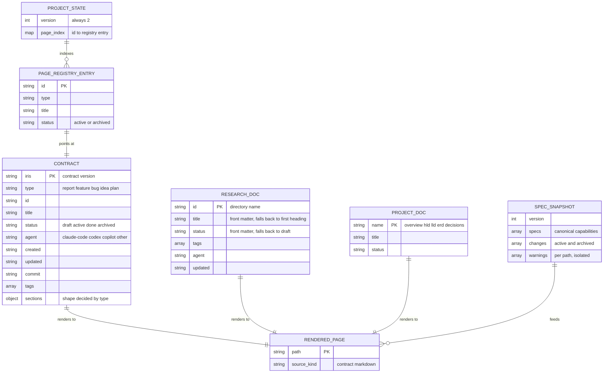

# ERD

The data model of `iris`. Every entity here is a file on disk — there is no database, and nothing is stored outside the repository it describes.

## Entities

## Notes

**The envelope is the contract.** `schemas/envelope.schema.json` requires all eleven fields on every record; `sections` is then validated against the per-type schema, so `bug` carries `symptom`/`severity`/`timeline`, `feature` carries `problem`/`goal`/`design`/`tasks`, `idea` carries `current_state`/`proposed`/`effort_impact`, `plan` carries `goal`/`steps`, and `report` carries `summary`/`open_items`/`promotable_as`. An invalid contract blocks rendering rather than producing a partial page.

**Research is Markdown-first.** `iris/research/<id>/index.md` is the editable source and `page.html` is generated output. Only five front-matter keys are read — `title`, `status`, `tags`, `agent`, `updated` — and each missing or malformed one degrades to a per-path warning rather than failing the render.

**State is deliberately thin.** `ProjectState` is version 2 and holds only the page registry needed for active/archive navigation. The version 1 shape carried `last_synced_sha`, `content_hashes`, a `stale` status, and per-entry source hashes; it is read only long enough to prove a legacy mirror is an unmodified Iris output before removing it, and every ambiguous record is preserved.

**The spec snapshot is generated, not authored.** `iris/spec.json` is a deterministic snapshot of the `openspec/` filesystem with no timestamp, replaced atomically by `iris init`, bare `iris render`, and `iris render --all`. Every other command reuses it, so there is no watcher.

**Identity is the directory name.** A page's `id` is its directory under `iris/pages/` or `iris/research/`; there is no separate key, which is why `iris <type> <id>` refuses a duplicate or malformed id up front.
