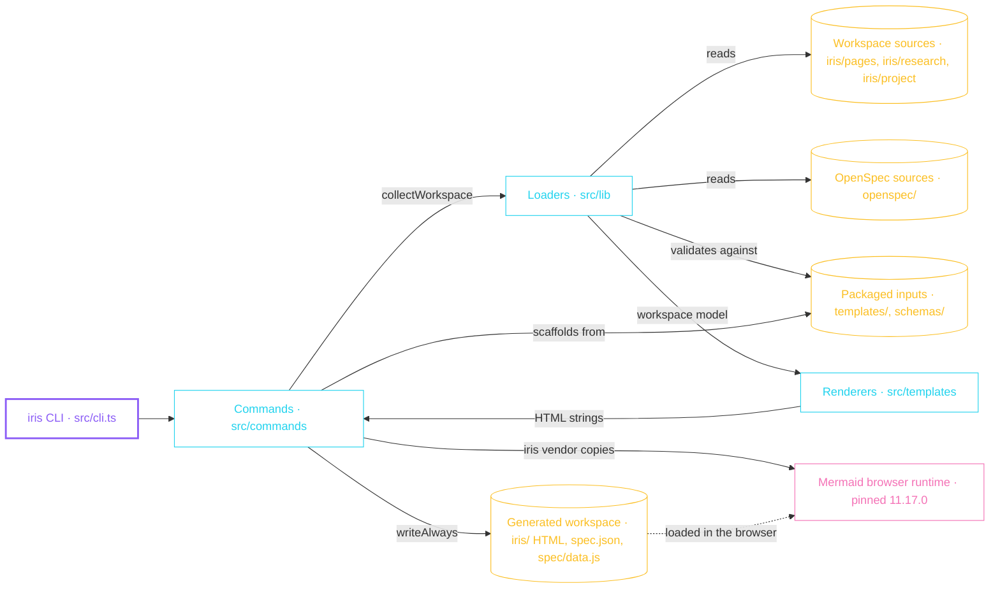

# HLD

High-level design: the shape of `iris` and how its parts fit together. Colours keep their meaning through the `classDef` lines: violet is the thing being described, cyan a service, amber a data store, lime an async path, pink an external system, red an error path.

## System map

## Boundaries

`src/cli.ts` owns argument parsing and dispatch, and nothing else. It maps one positional command onto one function in `src/commands` — `init`, `render`, `publish`, `report`, the draft commands (`feature`, `bug`, `idea`, `plan`, `research`), `archive`, `export`, `open`, `vendor`, and `update` — and turns a thrown `IrisError` into a message on stderr and an exit code.

`src/commands` orchestrates: it reads through the loaders, calls the renderers, and writes back what they return. Generated files go through `writeAlways` in `src/lib/fs.ts`, so a render overwrites managed output unconditionally and running it twice changes nothing. `writeIfMissing` creates the files that must survive later runs: `iris/config.yaml`, which belongs to the user from then on, and `iris/state.json`, which is created once and afterwards maintained by `saveProjectState` on every render. Three `src/lib` modules write as well, because each owns one generated artifact end to end: `openspec-workspace.ts` writes `iris/spec.json`, `project-state.ts` writes `iris/state.json` through `saveProjectState`, and `agent-skills.ts` installs the agent surfaces under `.claude/`, `.agents/`, and `.github/`.

`src/lib` owns the sources. Each loader owns one shape: `project-docs.ts` for `iris/project/*.md`, `research-workspace.ts` for `iris/research/*/index.md`, `openspec-workspace.ts` for `openspec/`, `agent-skills.ts` for the installed agent surfaces. They answer with data plus warnings rather than throwing on a bad source: an unreadable, symlinked, oversized, or badly named source is skipped and reported, so one broken file cannot stop the workspace from rendering. `schemas.ts` is the deliberate exception — a page contract that fails validation aborts the render, because rendering a page from a payload that does not match its schema is worse than stopping.

`src/templates` is pure. `renderSectionPages` returns a map of workspace-relative path to HTML string and never opens a file; the command layer writes what it is handed. That is what makes page output testable without a temporary directory.

The boundary that does not exist is the network. Generation happens entirely on local sources, and a generated page references only files inside `iris/` — the vendored Mermaid bundle, `design/tokens.css`, `design/components/base.css`, and `design/components/base.js`. Pages are meant to open over `file://`, so nothing is fetched at view time. `iris vendor` copies Mermaid out of the installed package in `node_modules` rather than downloading it.

Project docs have a second boundary worth naming: the Markdown under `iris/project/` is the source and belongs to whoever writes it, while `iris/project/*.html` is generated and carries `data-iris-managed`. `iris init` scaffolds a missing source from `templates/project/`, but it refuses to overwrite an HTML page that lacks the managed marker, and reports it instead.

## External dependencies

| Dependency      | Why it is here                                                                                                                    |
| --------------- | --------------------------------------------------------------------------------------------------------------------------------- |
| `ajv`           | Validates every page contract in `iris/pages/*/data.json` against `schemas/*.schema.json` before that page is rendered.           |
| `markdown-it`   | Renders Markdown sources to HTML at generation time, with embedded HTML disabled so a source cannot inject markup into a page.    |
| `mermaid`       | The pinned browser runtime that `iris vendor` copies into `iris/design/vendor/` so diagrams render offline from a `file://` page. |
| `lucide`        | Icon geometry serialised to inline SVG at generation time; a generated page never loads the library itself.                       |
| Node.js ≥ 22.13 | The only runtime requirement; the CLI is TypeScript compiled to ESM and depends on no system tooling beyond Node.                 |
