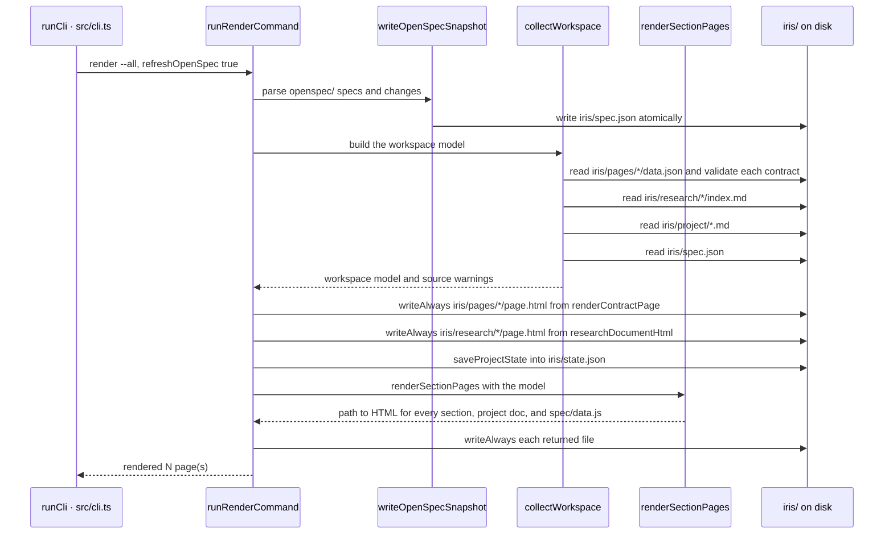

# LLD

Low-level design: how one render of the workspace actually works inside the CLI boundary. The flow below is `iris render --all`, the command every other command ends up calling.

## Key flow

## Modules

| Module                          | Responsibility                                                                       | Invariant                                                                                     |
| ------------------------------- | ------------------------------------------------------------------------------------ | --------------------------------------------------------------------------------------------- |
| `src/cli.ts`                    | Parse argv, dispatch one command, map `IrisError` to a message and an exit code      | An unknown command or a contradictory flag pair exits non-zero before anything is written     |
| `src/commands/render.ts`        | Collect the model, render every page, write every generated file                     | Page HTML comes from pure functions; every file it produces goes through `writeAlways`        |
| `src/commands/lifecycle.ts`     | Refresh managed surfaces: tokens, base CSS and JS, project doc sources, agent skills | A project doc HTML page without `data-iris-managed` is preserved and reported, never replaced |
| `src/lib/project-docs.ts`       | Load `iris/project/*.md` into front matter plus body                                 | A symlinked or oversized source is skipped with a warning rather than read                    |
| `src/lib/openspec-workspace.ts` | Parse `openspec/` into a snapshot and read it back                                   | The snapshot is written to a temp file and renamed, so a reader never sees a partial file     |
| `src/lib/schemas.ts`            | Validate a page contract against the envelope and its type schema                    | A contract that fails validation aborts the render with the field and a hint                  |
| `src/templates/workspace.ts`    | Turn the model into a map of workspace-relative path to HTML                         | Pure: it imports no filesystem module and returns strings                                     |
| `src/lib/fs.ts`                 | `writeAlways` for generated files, `writeIfMissing` for user-owned ones              | Generated output is overwritten every render, so rendering twice changes nothing              |

## Data shapes

`WorkspaceModel` (`src/templates/workspace.ts`) is the single value every page renderer reads. It carries the project name and theme, the dashboard page index, research items, the OpenSpec snapshot, the project doc items and the list of doc names to show in the sidebar, the installed agent surface report, and the warnings collected while loading sources. `collectWorkspace` returns it with one extra field, the raw contracts, which only the per-page render needs.

`iris/spec.json` is the OpenSpec snapshot: `version` 1, whether an `openspec/` directory was `detected`, then `canonical_specs`, `active_changes`, `archived_changes`, `legacy_archives`, and `warnings`. `loadOpenSpecSnapshot` falls back to an empty snapshot carrying a warning when the version or the array fields do not match, rather than rendering from a shape it does not recognise.

`iris/spec/data.js` assigns `globalThis.IRIS_SPEC = { records }`, where `records` is an object keyed `kind:name` — `capability`, `change`, or `legacy` — each holding the record's title, source path, and pre-rendered HTML. Every `<` in the JSON is escaped so record content cannot close the script element or open an HTML comment.

`iris/state.json` holds `page_index`, one entry per page with `id`, `type`, `title`, and `status`. Status is what distinguishes an active page from an archived one; archived entries keep their row on the dashboard and link into `iris/archive/`.
