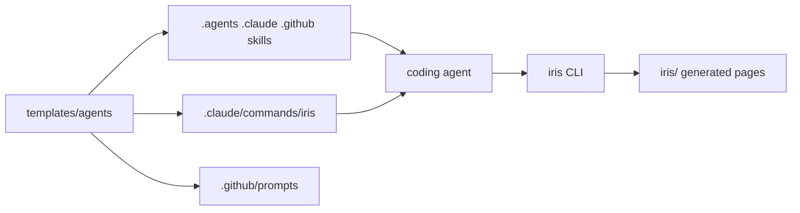

# Agent-first workspace decisions

## Question

How should Iris establish its workspace and agent instructions so that one installed
command sets everything up, nothing user-owned is clobbered, and agents know when to
reach for Iris at all?

## Findings

`iris init` is the single setup and upgrade operation. It scaffolds or refreshes the
workspace, migrates provably-generated legacy pages, installs every agent surface, and
renders each section page. It never copies or monitors `README.md` or `docs/**/*.md` —
implicit documentation ingestion was removed on purpose.

Agent instructions come from one packaged template per surface kind. The skill template
produces `.agents/skills/`, `.claude/skills/`, and `.github/skills/`; the command template
produces `.claude/commands/iris/` and `.github/prompts/`. Generating both from one source
is what keeps the instructions from drifting apart.

### Managed-region ownership

Every generated file carries ownership, version, and a SHA-256 body digest between
`IRIS:MANAGED` markers. An intact region is refreshed in place and bytes outside it are
preserved. Anything unmarked, half-marked, edited, symlinked, or escaping the repository
is preserved and reported as a collision instead of being overwritten.

### Conversational triggers

A skill that only describes the product never fires in conversation. The skill now names
the moments that call for Iris and maps each user intent to its command and generated
destination, so finished work lands on the dashboard without the user asking.

## Evidence

| Area                | What holds it                                          |
| ------------------- | ------------------------------------------------------ |
| Setup contract      | `src/commands/init.ts`, `src/commands/lifecycle.ts`    |
| Surface generation  | `src/lib/agent-skills.ts`, `templates/agents/*.md`     |
| Ownership behavior  | `tests/agent-skills.test.ts`                           |
| Packaged payload    | `scripts/verify-release.mjs`, `scripts/install-smoke.mjs` |

## Next steps

Nested OpenSpec capability paths and the MODIFIED, REMOVED, and RENAMED delta operations
still need explicit contract fixtures; the current repository only exercises one-segment
paths and ADDED sections, so graceful fallback for the rest is designed but not observed.
