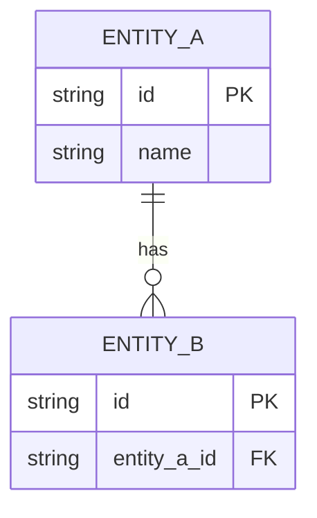

# ERD

The data model of `__PROJECT__`: entities, their fields, and the relationships between them. Replace the placeholder entities with the real ones.

## Entities

## Notes

Field meanings the name alone does not carry, constraints and keys, and the lifecycle of each record.
