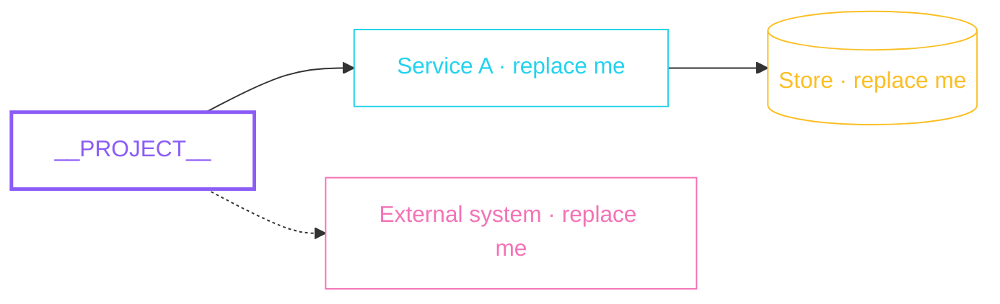

# HLD

High-level design: the shape of `__PROJECT__` and how its parts fit together. Replace the placeholder nodes below with the real components and keep the `classDef` lines so colours keep their meaning: violet is the thing being described, cyan a service, amber a data store, lime an async path, pink an external system, red an error path.

## System map

## Boundaries

Which subsystems exist, what crosses each boundary, and what deliberately does not.

## External dependencies

| Dependency | Why it is here |
| ---------- | -------------- |
| Replace me | Replace me     |
