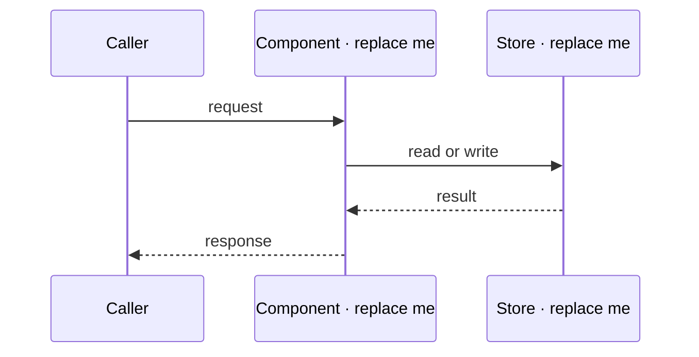

# LLD

Low-level design: how a component of `__PROJECT__` actually works inside its boundary. Replace the placeholder participants and steps with the real call path.

## Key flow

## Modules

| Module     | Responsibility | Invariant  |
| ---------- | -------------- | ---------- |
| Replace me | Replace me     | Replace me |

## Data shapes

The records, messages, or files that cross module boundaries, and what each field means when the name alone does not say.
