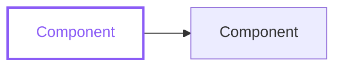

# Title

<!-- Replace the H1 and front matter with the real page title. Delete each hint line as you fill its section. -->

## TL;DR

<!-- 3-6 bullets: what was found, what to do, risk level. Start each bullet with a confidence badge. -->

- **[HIGH]** State the headline finding and the recommended action.

## Question & scope

<!-- The exact question in an info callout, then a "not covered" list that bounds the scope. -->

::: callout info Question
State the exact question this page answers.
:::

Not covered:

- Name what this page deliberately excludes.

## System map

<!-- One mermaid flowchart of the relevant subsystem. Keep the classDef block so diagram colors stay semantic. -->

## Code territory

<!-- The relevant subtree. A trailing * marks files this report dissects; an indented # line annotates a role. -->

<!-- prettier-ignore -->
::: filetree
src/
  lib/
    markdown.ts *
  index.ts
    # the layer this report dissects
:::

## Findings

<!-- One h3 per finding: confidence badge first, prose, then evidence citing path/file.ts:line. -->

### Finding title

- **[MED]** State the finding in one sentence.

::: evidence src=path/file.ts:42
Quote or paraphrase the code that proves it.
:::

## Metrics

<!-- Meter bars for coverage/risk/effort; plain tables for measurements. -->

::: meter label=Coverage value=72 tone=success
:::

## Key flows

<!-- Steps for the main call path; flow strips for hand-offs. !danger marks an error-path node. -->

::: steps

1. The entry point receives the request.
2. Control passes to the core module.

:::

::: flow
input -> parse -> render
input -> error !danger
:::

## Risks

<!-- One warn/danger callout per risk: name the blast radius and the probe that resolves the unknown. -->

::: callout warn
Name the risk, its blast radius, and the probe that resolves it.
:::

## Proposed direction

<!-- The recommendation in a success callout; migration phases as a timeline (!past/!warn/!danger on the when part). -->

::: callout success
State the recommended direction in one sentence.
:::

::: timeline

- Phase 1 :: Land the first increment.
- Phase 2 !warn :: Migrate the risky part.

:::

## Appendix

<!-- Raw dumps in details blocks. Every footnote marker in the body resolves to a file:line or commit/PR here. -->

::: details Raw data
Paste raw output or dumps here.
:::

Body text cites a source.[^1]

[^1]: path/file.ts:42 — what the citation proves.
